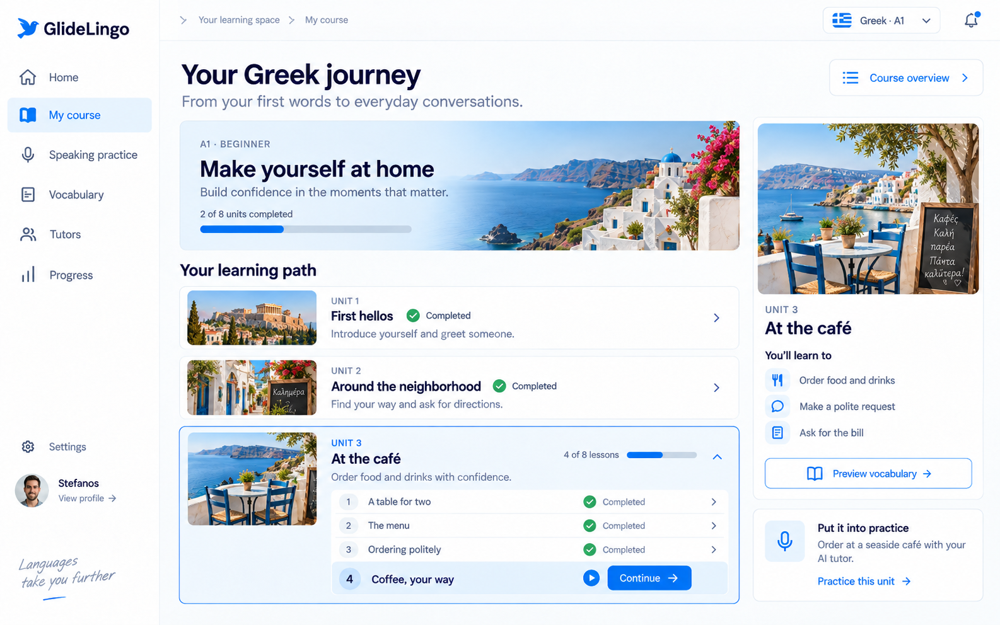
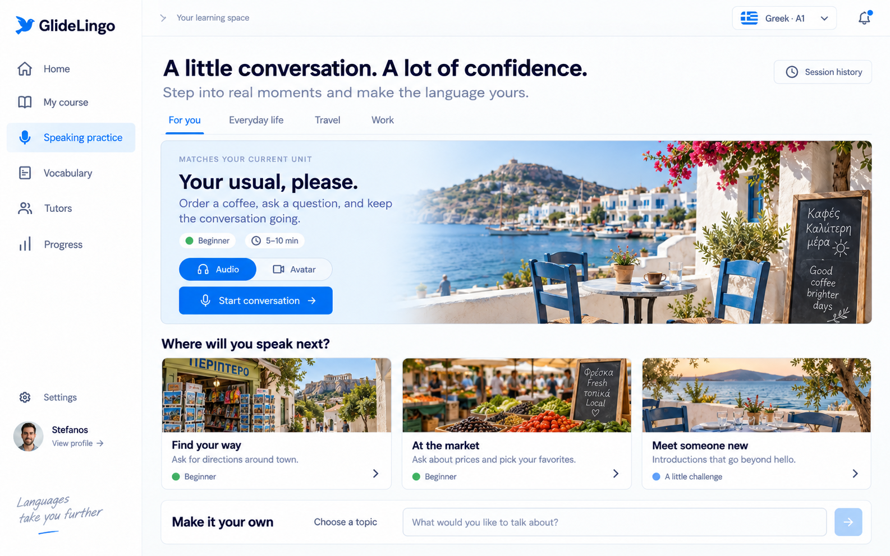
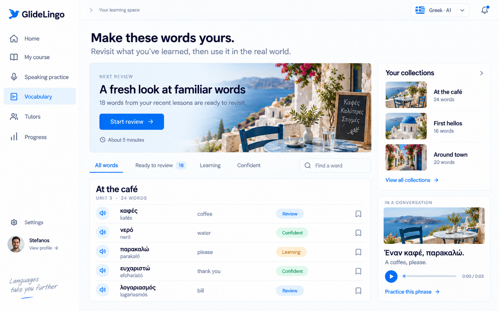
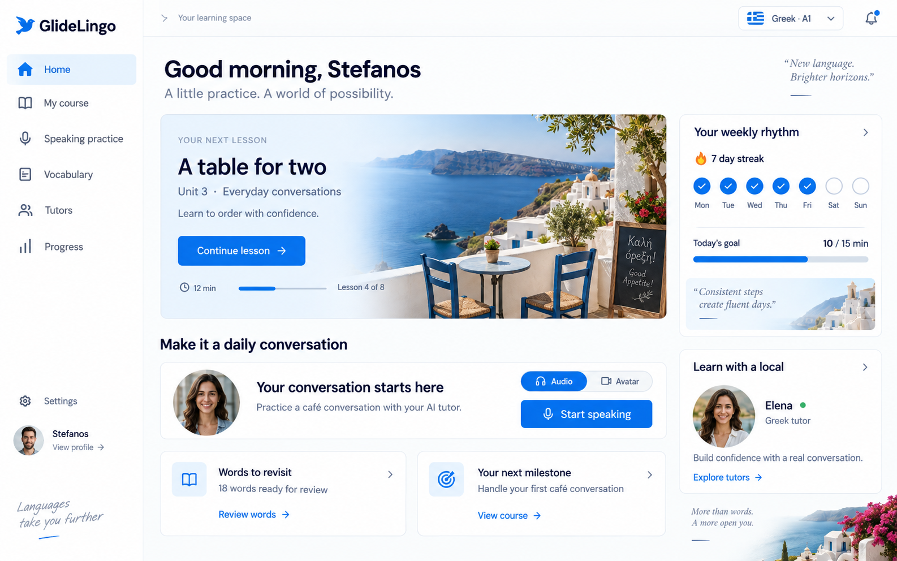

# GlideLingo visual implementation brief

Status: user-selected visual direction; implementation handoff.
Scope: shared authenticated app styling, Home, My Course, Speaking Practice, and Vocabulary/Practice.
Source baseline inspected: `cd1162704d767add9afc8e8dde6f9b36f189dee6`.

## Start here

Implement the visual direction in the **three-screen set below**. The user explicitly selected My Course, Speaking Practice, and Vocabulary Review from that set. The original Home concept supplies the shared shell and homepage reference.

The desired result is a premium, welcoming language-learning app with azure actions, navy typography, pale-blue surfaces, themed destination imagery, and generous but useful spacing. Each unit feels like a real situation the learner can enter.

This is a deliberate visual evolution from the current compact Zinc/charcoal system. Do not interpret “follow the existing design system” as a request to recreate that older appearance. Keep the shared token/component architecture, native behavior, and learning-state contracts while updating their visual expression.

**Do not use the later charcoal-button version or the later simplified homepage as the target.** Neither is included in this reference pack.

This PR is a specification and reference-image handoff. It does not implement the screens or enable unavailable features.

## Authoritative visual references

Open these images before coding; do not work only from this prose.

### My Course — primary reference

### Speaking Practice — primary reference

### Vocabulary Review — primary reference

### Original Home — supporting shell and homepage reference

Reference priority: the three primary screenshots establish the chosen direction; the Home image fills in homepage composition. Written behavior and accessibility requirements govern any misleading mockup detail. These are generated concepts: sample counts, people, text, lesson titles, flags, and availability are not production data.

## Visual contract

| Area | Implementation direction |
| --- | --- |
| Personality | Bright, adult, premium, inviting, and grounded in real places. |
| Type | Retain Inter in the app; use its regular, medium, and semibold weights to approximate the references. Ensure Greek glyph coverage. Never embed screenshot text as an image. |
| Headings | Deep navy, prominent and readable. Desktop page titles around 32–36px, hero titles 28–34px, section titles 22–24px. |
| Body | Muted blue-gray, generally 15–17px with comfortable line height. Supporting labels 12–14px; avoid tiny low-contrast text. |
| Actions | Azure filled primary actions; blue text/outline secondary actions. Dark charcoal is not the normal primary action in this direction. |
| Surfaces | White/off-white canvas, white cards, delicate pale-blue borders, pale-blue selected navigation. |
| Corners | Approximately 12–16px content cards; 8–12px buttons and controls. Capsule shapes only where the reference calls for chips/toggles. |
| Depth | Hairline borders and very soft shadows; avoid heavy elevation. |
| Spacing | Retain a 4px-based scale. Use 24–32px between major sections and 20–32px within larger cards. |
| Photography | Sunlit, natural, context-specific images with a consistent photographic treatment. Images support unit/scenario identity. |
| Hero treatment | Photo on the right with a pale-blue-to-transparent blend behind the left-hand text. Preserve legibility at every viewport size. |
| Icons | Consistent simple outline icons; blue selected/active states. Use existing brand assets and icon infrastructure. |
| Cards | Preserve the useful card groupings and scenario thumbnails in the selected set. Do not strip the pages into the later minimal redesign. |
| Copy | Short, useful, confident. Decorative handwritten slogans in the mockups are optional and should not introduce a second UI font. |

### Proposed token starting points

These are implementation starting values inferred from the images, **not exact sampled values or existing tokens**. Tune them together against the references and validate contrast.

| Semantic role | Light appearance starting value |
| --- | --- |
| Main canvas | `#FCFDFF` |
| Card surface | `#FFFFFF` |
| Primary text | `#0B163F` |
| Secondary text | `#52678D` |
| Primary action | `#006FE8` |
| Action hover/pressed | `#005BC4` |
| Selected/soft accent | `#EAF5FF` |
| Border/separator | `#E1EAF5` |
| Completion | `#16834A` text/icon on `#EAF8EF` |
| Attention/review state | `#8A5700` text on `#FFF3DB` |

Add or adjust semantic roles in `src/constants/theme.ts` and consume them through `useTheme()`. Do not scatter raw colors through screens. Preserve existing role meanings, including status/error colors. Update both light and dark palettes; the screenshots define light mode, so dark-mode values require deliberate adaptation.

## Shared shell and responsive layout

- Desktop: use a 232–256px expanded sidebar, a roughly 64px top bar, and 28–36px main-content padding. Preserve the existing collapsed-sidebar control and its behavior.
- Keep the bird mark blue and the wordmark navy in light mode. Use the repository brand asset instead of tracing the generated bird.
- Retain a single shared navigation configuration. Reuse existing route IDs and deep links.
- Desktop labels can become “My course” and “Speaking practice” while keeping route IDs `course` and `speak`.
- The reference says “Vocabulary,” but the current Practice destination also contains letters and phrases. Keep those modes accessible; do not erase them to match a screenshot.
- Keep current course/language selection, profile/settings, and desktop-update controls reachable. Do not add a dead notification button or a dead Tutors route just to fill the shell.
- At widths of roughly 1180px and above, use the reference's broad primary column and 300–350px support rail. Constrain readable text separately from the dashboard canvas.
- At intermediate widths, collapse the rail or move support content below the main task. Preserve useful hierarchy instead of squeezing text.
- On mobile, retain native navigation and use one content column. Stack scenario cards and collapse vocabulary rows gracefully. Content and hit targets must remain usable at increased text sizes.
- These dimensions are responsive starting points, not fixed screenshot coordinates. Check 1440×900, 1280×800, and a representative 390px mobile viewport.

## Page requirements

### Home

Use `references/home.png`.

- Greeting and current language context at the top.
- Dominant next-action lesson/review card with themed photography, a short outcome, a clear CTA, and honest duration/progress metadata.
- Speaking-practice entry with audio/avatar controls only when supported.
- Review and next-milestone modules beneath.
- Right rail for weekly rhythm and an available tutor entry, if backed by actual functionality.
- Preserve `selectHomeNextAction`: the hero may recommend review rather than a lesson. Never hardcode “Continue lesson” over a real review recommendation.
- Preserve the active lesson rendering branch in Home; opening a lesson must still reach the existing lesson experience.

### My Course

Use `references/my-course.png`.

- Scenic course overview with course/language/level and real course completion.
- Stacked themed unit cards with thumbnail, title, outcome, and explicit completion/current/unavailable state.
- The current unit expands into numbered lesson rows with clear completed and next-lesson treatments.
- A right-side unit detail card shows the matching photo, learning outcomes, and vocabulary entry.
- A contextual speaking entry belongs to that unit when the underlying capability is available.
- Reuse the catalog, `ModuleTree`, authored-unit availability, completion selectors, and `openLesson`. Preserve unpublished and all-available-lessons-complete states.
- Fix generated inconsistencies: “4 of 8 completed” requires four actual completions; if lesson 4 is next after three completions, show “3 of 8 completed” or “Lesson 4 of 8.”

### Speaking Practice

Use `references/speaking-practice.png`.

- Category tabs and a featured scenario related to the current unit.
- Hero contains scenario title, short outcome, level, estimated duration, audio/avatar selector, and primary conversation CTA.
- Below, themed scenario cards provide title, short description, level, and a clear entry action.
- A custom-topic composer and session history appear only with supported behavior.
- The current `speak.tsx` explicitly reports live scenarios unavailable. Restyle loading/error/unavailable states in this visual system while keeping them honest.
- Build the complete visual target in an isolated development preview with labeled fixture data if runtime support is absent. Do not enable runtime flags, invent completed sessions, or promise that upgrading unlocks an unavailable feature.

### Vocabulary / Practice

Use `references/vocabulary-review.png`.

- Themed review hero with a truthful due count and action.
- Search and status filters above readable rows: pronunciation control, target word, optional transliteration, translation, and evidence-backed state.
- The right rail groups vocabulary by unit and presents an example phrase with pronunciation.
- Preserve Greek spelling and accents; use authored content rather than copying AI-generated image text.
- Preserve existing letters, phrases, and review modes under Practice; vocabulary is a view within that experience.
- Current review items are tied to lesson evidence. Do not relabel a lesson queue count as a word count. If per-word data or collection/search/bookmark support is absent, show the fully designed state in the isolated preview and use an accurate supported production state.
- No due items: show a useful “You’re caught up” state, preserve access to learned material, and avoid a primary action that cannot do anything.

## Themed content and imagery

Use a consistent visual identity across a unit’s course card, speaking scenarios, and vocabulary collection. “At the café” should share a recognizable setting and image treatment across those pages.

Keep language identity distinct from a single country or stereotype. Greek is the example in this pack; language/culture and unit content drive the imagery. Do not show Greek scenery for every other language.

Define a small typed mapping keyed by stable course/unit/scenario IDs for image source, focal point, and optional accessibility description. Reuse catalog metadata where practical. Use approved existing assets or separately sourced/generated images with recorded provenance.

The PNGs in this folder are whole-screen design references, not production background assets. Build real accessible components; do not put a screenshot behind clickable hotspots or crop text/controls out of it.

Use local/approved assets, appropriate image sizing, stable aspect ratios, and deterministic fallbacks. When imagery fails, retain the pale-blue surface and all actionable text. Avoid arbitrary remote image dependencies.

## Repository implementation map

Paths verified against the source baseline above; recheck before editing.

| Responsibility | Existing entry points |
| --- | --- |
| Semantic tokens / typography | `src/constants/theme.ts`, `src/hooks/use-theme.ts`, `src/components/themed-text.tsx` |
| Shared surfaces / actions | `src/components/ui/glide-surface.tsx`, `glide-button.tsx`, `glide-button.web.tsx`, `progress-bar.tsx` |
| Desktop / web navigation | `src/components/app-tabs.web.tsx`, `src/features/product-shell/navigation.ts` |
| Native navigation | `src/components/app-tabs.tsx` |
| Layout / header | `src/components/screen-frame.tsx`, `screen-header.tsx`, `screen-header-layout.ts` |
| Home | `src/app/(app)/index.tsx`, `src/features/product-shell/home-next-action.ts` |
| Course | `src/app/(app)/course.tsx`, `src/components/module-tree.tsx` |
| Speaking | `src/app/(app)/speak.tsx` |
| Practice / vocabulary | `src/app/(app)/practice.tsx`, `src/features/product-shell/letters-practice.tsx`, `phrases-practice.tsx` |
| Learning state | `src/providers/learning-provider.tsx`, `src/features/learning-progress/` |
| Brand | `src/components/glidelingo-brand-mark.tsx`, `glidelingo-brand-mark.web.tsx`, `assets/brand/` |

Keep Expo/React Native, Expo Router, Electron, and current shared component boundaries. This brief does not request a stack migration or a separate marketing website. Prefer small reusable components for themed heroes, scenario cards, and unit/word rows; avoid a new parallel design framework.

## Implementation sequence

1. Inspect root guidance, current routes/state, and all four reference images. Inventory existing capabilities and assets before editing.
2. Update semantic tokens and existing primitives. Add only the layout/imagery variants required by these screens.
3. Implement the shared desktop shell and Home visual treatment; verify navigation and the lesson entry/resume loop.
4. Implement My Course using real authored catalog/state.
5. Implement the Speaking and Vocabulary visual surfaces with supported interactions. Keep full unavailable-feature concepts in a clearly isolated preview using fixtures; never feed fixture data into production providers.
6. Adapt responsive and dark appearances, image fallbacks, focus states, and loading/error/empty states.
7. Compare rendered screenshots against the selected references, refine visible differences, and update `DESIGN_SYSTEM.md` to accurately describe implemented tokens/components.

Complete a usable visual slice before expanding scope. Record backend/data gaps separately; do not turn a styling task into a billing, curriculum, avatar-provider, or tutor-marketplace implementation.

## Acceptance criteria

- [ ] All three primary screenshots were opened and used during implementation.
- [ ] The result visibly matches their blue/white, navy-type, scenic-card direction; it does not revert to charcoal primary buttons or the later simplified homepage.
- [ ] Navigation, buttons, cards, spacing, typography, and imagery treatment are consistent across the four pages.
- [ ] Units share a coherent theme across course, speaking, and vocabulary.
- [ ] Every production count, learning status, selected language, and availability indicator comes from real state.
- [ ] All enabled controls work; unsupported features have an honest designed state.
- [ ] Existing course selection, lesson entry/resume, review, letters/phrases, billing gates, and desktop-update behavior remain intact.
- [ ] Hover, pressed, keyboard focus, selected, loading, error, empty, and disabled states are legible and consistent.
- [ ] Text contrast, non-color status cues, screen-reader labels, reduced motion, and adequate hit targets are preserved.
- [ ] No horizontal page overflow at reviewed widths; Greek text and larger text sizes do not clip.
- [ ] Light and dark mode render coherently. Images have stable layout and a readable failure fallback.
- [ ] Implementation screenshots and any remaining capability gaps are supplied in the implementation PR.

## Verification and completion report

For the eventual UI implementation, run `npm run verify` and the additional gates required by root `AGENTS.md` for the actual changed scope. Exercise the changed screens through visible controls; do not call a styling match verified from compilation alone. Follow applicable repository UI verification guidance when conducting runtime walkthroughs.

Capture the three target pages at the same desktop viewport, plus Home and a representative mobile layout. Compare side by side with these references. Report what changed, what was exercised, any unavailable feature states, and known visual differences.

This specification-only PR needs reference-link and file-integrity checks; it does not claim runtime UI tests or implemented screens.

## Prompt to give your coding agent

> Implement the visual refresh in `docs/design/premium-learning/IMPLEMENTATION_BRIEF.md`. First open all images in its references folder, especially My Course, Speaking Practice, and Vocabulary Review. Those three screens are the user-selected target; the original Home image supports the shared shell. Update the existing Expo/React Native app and shared semantic tokens/components to match that premium blue-and-white, navy-type, themed-photography direction. Preserve real learning state, existing routes, lesson/review flows, availability and billing gates, native behavior, and desktop updates. Follow the brief’s page requirements, responsive rules, and acceptance checklist. Build supported behavior on the real routes and use an isolated development preview for unavailable scenario or word-data features. Visually compare the implementation to the references, run the required checks for your changed scope, and return screenshots with remaining gaps.
