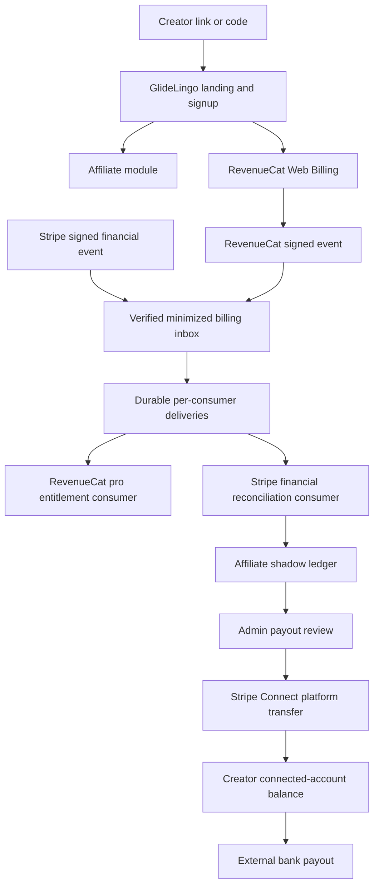
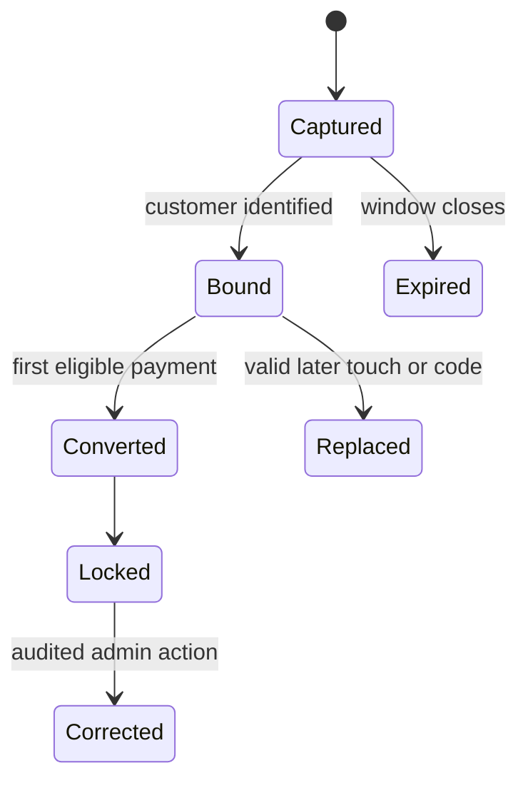
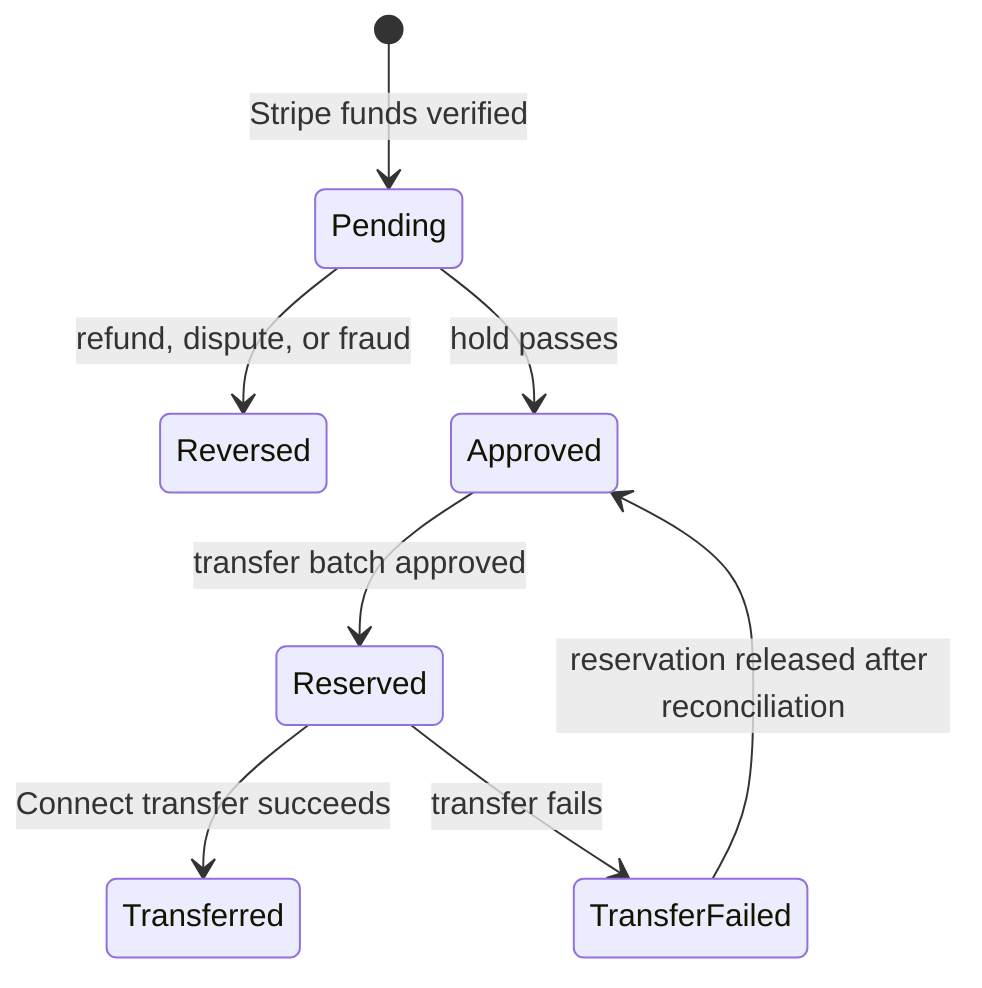

# Affiliate and Creator Growth Program Requirements

**Status:** Proposed post-core growth contract; all implementation and enablement remain disabled

**Repository target:** GlideLingo `main` through a reviewed pull request

**Initial platform:** `glidelingo.com` acquisition with explicit authenticated web/Electron handoff; mobile-compatible account access

**Related contracts:** [`PRODUCT.md`](../../PRODUCT.md), [`V1-PRODUCT-EXPERIENCE.md`](./V1-PRODUCT-EXPERIENCE.md), [`AUTH-MVP.md`](../AUTH-MVP.md), [`BILLING-MVP.md`](../BILLING-MVP.md), and the [implementation roadmap](../infra/IMPLEMENTATION-ROADMAP.md)

## 1. Purpose

This document defines the reusable affiliate and creator-growth system for GlideLingo.

The system must let GlideLingo:

- give each approved creator a shareable link and promo code;
- give an eligible new customer a configurable subscription offer;
- preserve referral attribution from click through paid subscription;
- calculate commissions only from verified, collected subscription revenue;
- hold, reverse, approve, and pay commissions safely;
- support refunds, chargebacks, cancellations, plan changes, and failed payments;
- measure creator quality using retained revenue instead of clicks alone;
- change future program terms without rewriting historical earnings;
- replace discount, billing, or payout providers without replacing the affiliate domain.

This is a requirements document, not a claim that the feature currently exists. The current repository has Clerk identity and a RevenueCat `pro` entitlement boundary. Affiliate attribution, discounts, financial intake, commissions, creator administration, Stripe financial reconciliation, Connect transfers, and external payouts are new work. Merging this document must not create provider accounts, provision credentials, run migrations, move money, or enable a feature.

## 2. Product outcome

A creator may eventually be able to say the following, but the offer is illustrative until the owner approves the exact discount and duration:

> Use my link to try GlideLingo and receive 15% off your first three monthly payments.

The customer follows the link, creates an account, subscribes, receives the correct offer, and gets the normal `pro` entitlement. GlideLingo records the creator relationship. When verified payments settle, the creator earns commission under the program version that governed that conversion.

The first affiliate launch should be operationally simple:

1. GlideLingo staff approve creators.
2. The system issues one default link and one code per creator.
3. Creators publish short, natural product demonstrations.
4. Customers subscribe through RevenueCat Web Billing.
5. Verified RevenueCat and Stripe events enter a durable minimized billing inbox and independently retryable consumer deliveries.
6. A shadow financial consumer reconciles Stripe cash facts before it creates or reverses commission ledger entries.
7. Staff review a proposed Connect transfer batch under separation-of-duties controls.
8. Stripe Connect first transfers approved funds to a creator's connected-account balance; Stripe then pays that balance to the creator's external bank account under the approved payout configuration.

### 2.1 Release classification

This program is **post-core growth work**. It is not a blocker for the initial learning-product release or the V1 definition of done in [`PRODUCT.md`](../../PRODUCT.md). Documentation may become merge-ready now, and future code may merge in small disabled slices, but customer offers, attribution, ledger effects, creator access, Connect transfers, and external payouts must all remain off until their applicable gates pass.

## 3. Scope and non-goals

### 3.1 In scope

- Affiliate applications, approval, suspension, and termination.
- Creator links, promo codes, campaigns, and attribution.
- Configurable customer discounts.
- Versioned commission rules.
- Immutable financial ledger and adjustments.
- Refund, dispute, and cancellation handling.
- Creator Connect onboarding, reviewed transfer batches, and external payout observability.
- Creator dashboard, internal operations dashboard, analytics, and exports.
- Flat-fee creator campaigns in addition to affiliate commissions.
- Fraud controls, disclosures, auditability, and privacy.
- Testing and release gates.

### 3.2 Not in the initial affiliate launch

- A public creator marketplace.
- Multi-level or downstream affiliate commissions.
- Creators setting their own discounts or commission terms.
- Crypto payouts.
- Automatic payouts without operator review.
- A separate affiliate microservice.
- A custom tax or identity-verification system.
- Native App Store or Google Play promo-code attribution unless provider tests prove it end to end.
- Retroactively changing earned commissions when a new program version launches.

## 4. Unapproved proposed starting defaults

These values are examples for owner review. None is approved, operative, or safe to publish. Every exact value must remain versioned configuration rather than hard-coded business logic.

| Policy | Proposed default | Decision state | Notes |
| --- | ---: | --- | --- |
| Customer offer | 15% off | Proposed; owner approval required | New customers only |
| Discount duration | Three-month provider window | Proposed; owner approval required | RevenueCat applies a discount to every invoice created in the configured window; annual products require a separate policy |
| Affiliate commission | 25% | Proposed; owner approval required | Applied to the owner-approved eligible revenue basis |
| Commission term | First 12 paid months | Proposed; owner approval required | Counted from the attributed subscription start |
| Click attribution window | 30 days | Proposed; owner approval required | From valid referral click to identified signup or purchase |
| Attribution model | Last eligible creator touch | Proposed; owner approval required | Explicit valid promo code wins at checkout |
| Attribution lock | First paid subscription | Proposed; owner approval required | Staff-only audited correction is possible |
| Commission hold | 30 days | Proposed; owner approval required | Pending until the approved refund/dispute-risk rule passes |
| Transfer review cadence | Monthly | Proposed; owner approval required | Operator-reviewed Connect transfer batch |
| Minimum transfer | USD $50 equivalent | Proposed; owner approval required | Requires an approved currency-conversion policy |
| Settlement currency | USD | Proposed; owner approval required | Must not imply one-currency launch support |
| Creator countries | None selected | Proposed; owner approval required | Legal, tax, Connect, and cross-border coverage must be evidenced first |
| Tax treatment | None selected | Proposed; owner approval required | Define included/excluded taxes per jurisdiction and product |
| Processing-fee treatment | None selected | Proposed; owner approval required | Define whether Stripe/RevenueCat fees reduce the basis |
| Currency conversion | None selected | Proposed; owner approval required | Define source rate, timestamp, rounding, and who bears FX costs |
| Self-referrals | Prohibited | Proposed policy; legal review required | Includes controlled accounts and payment instruments |
| Transfer/payout provider | Stripe Connect | Proposed provider; provider/legal approval required | Hosted onboarding preferred; exact account configuration remains unselected |

### 4.1 Required owner review

The product owner must approve the exact values in a dated decision record before any slice makes them active. In particular:

- commission percentage and earning term;
- whether annual plans receive a first-payment discount, a different discount, or no affiliate discount;
- attribution model and window;
- transfer minimum, review cadence, connected-account payout schedule, and supported countries;
- settlement and presentment currencies plus the source, timing, and rounding of any currency conversion;
- treatment of taxes, payment fees, RevenueCat fees, Stripe fees, credits, and currency conversion in commissionable revenue;
- whether paid creator content fees are tracked in this system or in a separate expense workflow.

## 5. System principles

### AFF-CORE-001 — Separate entitlement from commission

RevenueCat remains authoritative for whether the customer has `pro`. The affiliate system must never grant, extend, or revoke a learning entitlement.

### AFF-CORE-002 — Server-authoritative money

The browser may capture a referral click, but it must never create an approved commission, transfer, or payout. Only scoped authenticated administrative actions and idempotent server workflows based on verified provider state may change financial state.

### AFF-CORE-003 — Append-only accounting

Financial history must be represented by immutable ledger entries. Refunds and corrections create reversing or adjusting entries; they do not edit or delete the original earning.

### AFF-CORE-004 — Version every program

Every conversion must reference an immutable program-version snapshot. Future policy changes affect new conversions only unless an explicit, audited migration says otherwise.

### AFF-CORE-005 — Idempotent events

Every webhook, consumer delivery, commission calculation, approval action, Connect transfer, and external payout observation must have a stable idempotency key. Replaying the same event must not duplicate money.

### AFF-CORE-006 — Provider adapters

RevenueCat discounts and Stripe financial/Connect capabilities are proposed providers, not the affiliate domain itself. Provider-specific identifiers remain behind interfaces.

### AFF-CORE-007 — Integer money

Store monetary amounts in integer minor units with an ISO currency code. Never calculate or persist money using binary floating-point values.

### AFF-CORE-008 — Operational safety first

The initial affiliate launch uses a staff-reviewed Connect transfer batch. Automatic transfers are out of scope until reconciliation, fraud controls, alerting, and recovery have been proven. External payouts follow a separately approved connected-account configuration.

## 6. Architecture

The first implementation belongs in the existing FastAPI modular monolith and PostgreSQL database.



### 6.1 Responsibilities

| Component | Owns | Must not own |
| --- | --- | --- |
| Clerk | Authentication and stable principal subject | Creator membership, staff authorization, or commission calculations |
| GlideLingo authorization | Server-owned principal-to-creator memberships, scoped staff roles, revocation, and separation of duties | Authentication credentials or client-asserted roles |
| RevenueCat | Exact `pro` entitlement and RevenueCat Billing discount/purchase flow | Cash-settlement truth, creator balances, commission, Connect transfers, or external payout accounting |
| Stripe financial resources | Authoritative web-billing charges, refunds, disputes/chargebacks, fees, and balance transactions | `pro` entitlement or GlideLingo commission policy |
| GlideLingo affiliate module | Attribution, program versions, commission policy, ledger, creator state | Card data or bank-account collection |
| PostgreSQL | Durable program, attribution, minimized event intake, per-consumer delivery, ledger, transfer, payout, authorization, and audit records | External provider secrets or raw bank data |
| Stripe Connect | Hosted onboarding, identity requirements, bank destination, platform-to-connected-account transfers, and connected-account-to-bank payout status | GlideLingo attribution or commission policy |
| Client | Referral capture, creator/customer UI, admin UI | Financial authorization |

### 6.2 Proposed repository placement

Keep this as a vertical slice, following the existing `billing` and `lesson_tutor` module pattern:

```text
backend/app/modules/affiliates/
  api.py
  application.py
  domain.py
  repository.py
  schemas.py
  service.py

backend/app/modules/billing_events/
  intake.py
  delivery.py
  reconciliation.py

backend/app/integrations/stripe_connect/
  client.py
  models.py
  webhook.py

src/features/affiliates/
  affiliate-client.ts
  affiliate-types.ts
  referral-session.ts

src/features/creator-dashboard/
src/features/admin-affiliates/
backend/migrations/004_affiliate_creator_program.sql
```

The migration number is illustrative because `main` may add migrations before implementation. Exact filenames may follow the repository's current conventions. The boundaries and responsibilities are requirements. The durable delivery worker is justified here because financial processing must survive request/process failure and retry independently; it must not be scaffolded before the financial-intake slice.

## 7. User roles

| Role | Capabilities |
| --- | --- |
| Visitor | Follow a referral link, retain an opaque handoff code for the bounded session, and view offer disclosure |
| Customer | Create account, redeem eligible offer, see applied discount in checkout |
| Applicant | Submit a creator application and accept terms for the authenticated principal |
| Creator member | Act only for creator records connected through an active server-owned membership |
| Program operator | Review applications, manage campaigns/links, suspend creators, and investigate attribution |
| Finance reviewer | Reconcile provider truth, review releases and batches, and export financial records |
| Transfer approver | Approve a specific Connect transfer batch after independent review |
| Transfer executor | Execute only a previously approved batch; cannot approve the same batch |
| Auditor | Read audit, reconciliation, ledger, transfer, and payout evidence without mutation rights |
| Platform administrator | Provision or revoke scoped memberships; receives no implicit power to approve or execute money movement |

Role authorization must be server-enforced. Hiding buttons is not authorization.

### 7.1 Membership and authorization contract

- **AFF-AUTHZ-001:** FastAPI derives the Clerk subject from the verified session. No route accepts a submitted Clerk user ID, creator ID, role, or staff flag as authority.
- **AFF-AUTHZ-002:** A server-owned membership links one internal principal to one creator with a scoped role, status, grantor, reason, and validity interval. Creator records may support multiple members without sharing credentials.
- **AFF-AUTHZ-003:** Every creator read or mutation checks an active membership for that exact creator. Possession of a creator, application, ledger, batch, transfer, or payout ID is never authorization.
- **AFF-AUTHZ-004:** Staff permissions are explicit capabilities, not a single `is_admin` flag and not unverified client or Clerk public metadata.
- **AFF-AUTHZ-005:** Revocation is effective on the next server request even when the Clerk session remains valid. Revoked access tokens cannot be used to retain cached creator or financial data.
- **AFF-AUTHZ-006:** The principal that prepares or reviews a transfer batch cannot approve and execute that same batch. Any threshold for additional approval is owner-controlled policy.
- **AFF-AUTHZ-007:** Membership grants, role changes, revocations, emergency overrides, and denied sensitive actions are audit logged with actor, scope, reason, and timestamp.
- **AFF-AUTHZ-008:** Application approval does not implicitly grant financial permissions, and creator membership never grants staff permissions.

## 8. End-to-end customer journey

### AFF-CUST-001 — Referral entry and selected cross-origin handoff

Each creator receives a canonical URL such as:

```text
https://glidelingo.com/r/{creator_slug}?campaign={campaign_slug}
```

The selected design does not depend on a cookie crossing from the static marketing site to an authenticated client:

1. A future Cloudflare edge route for `https://glidelingo.com/r/{creator_slug}` forwards the validated slug/campaign to a public FastAPI referral-intake endpoint. The current Astro site is static, so this dynamic route is new disabled work.
2. FastAPI validates that the creator, link, program, and campaign are active, records a privacy-safe click, and creates an opaque random, short-lived, single-use handoff code backed by a server record. It exposes no internal creator or principal ID.
3. The edge route returns the customer to a `glidelingo.com` offer page with the code in the URL fragment. The marketing client may retain it only in memory or origin-scoped session storage until the customer chooses a destination.
4. The default browser path forwards the fragment to a future authenticated Expo web deployment at `https://app.glidelingo.com/referral#handoff=...`. `app.glidelingo.com` is a new deployment boundary and must receive explicit Clerk authorized-party, API CORS, CSP, DNS, and release configuration before use.
5. A user-initiated **Continue in GlideLingo** action may open `glidelingo://app/referral?handoff=...`. The Electron main process must add and validate only that exact host/path plus a bounded opaque value; the current package accepts only `/sign-in` and `/sso-callback`, so this route does not exist yet. If the app is absent, the page falls back to the web path or download guidance.
6. After Clerk authentication, the chosen client posts the opaque code in the request body to the binding endpoint. FastAPI derives the Clerk principal, atomically consumes the code, and stores the attribution decision.
7. Logs, analytics, page titles, and referrers must not retain the handoff code. Expiry or replay produces a recoverable no-attribution state and never blocks ordinary signup or purchase.

`https://desktop.glidelingo.com` is Electron's local virtual packaged-renderer origin and has no public DNS deployment. It is not the authenticated browser destination. No design in this program relies on cookies, local storage, or Clerk state being shared among `glidelingo.com`, `app.glidelingo.com`, the RevenueCat checkout origin, and Electron.

### AFF-CUST-002 — Signup binding

When Clerk creates or identifies the customer, the server derives the verified principal and binds the eligible handoff code to an internal principal reference. Email addresses, phone numbers, and client-submitted user IDs must not be referral keys.

### AFF-CUST-003 — Offer display

The landing page and checkout entry must state:

- the exact percentage discount;
- the number of discounted payments or applicable duration;
- the normal price after the offer;
- who is eligible;
- that the subscription renews unless canceled;
- any restriction for monthly versus annual plans.

### AFF-CUST-004 — Checkout

The customer enters the existing RevenueCat Billing purchase path. The eligible creator code is auto-applied where supported. The checkout must display provider-confirmed pricing; GlideLingo must not calculate a fake discounted total in the client.

### AFF-CUST-005 — Success

After successful checkout:

- the existing billing path reconciles the `pro` entitlement;
- the affiliate system records the provider purchase/invoice reference;
- attribution becomes locked according to policy;
- the first commission remains `pending` until the verified payment and hold rules are satisfied.

### AFF-CUST-006 — No entitlement coupling

If affiliate recording fails after a successful purchase, the customer must still receive the valid subscription entitlement. The affiliate failure is queued or surfaced for reconciliation; checkout is not rolled back.

## 9. Attribution requirements

### 9.1 Attribution states



### 9.2 Rules

- **AFF-ATTR-001:** A valid promo code entered or auto-applied at checkout overrides conflicting handoff attribution.
- **AFF-ATTR-002:** Without a code, the last eligible creator touch inside the attribution window wins.
- **AFF-ATTR-003:** Direct visits after a valid creator touch do not erase it.
- **AFF-ATTR-004:** Paid search, brand bidding, coupon scraping, self-referral, bot traffic, and prohibited placements are ineligible.
- **AFF-ATTR-005:** Attribution locks on the first successful eligible paid subscription.
- **AFF-ATTR-006:** A customer can have only one commission recipient for a single invoice line.
- **AFF-ATTR-007:** Staff corrections require a reason, actor ID, timestamp, old value, new value, and compensating ledger entries when money is affected.
- **AFF-ATTR-008:** Clearing browser session state prevents an unbound handoff from continuing but does not delete already-bound server records subject to retention policy.
- **AFF-ATTR-009:** Anonymous referral data must expire on a configured schedule.
- **AFF-ATTR-010:** A creator's suspension blocks new attribution immediately without erasing valid historical earnings.

### 9.3 Mobile compatibility

The initial affiliate launch may acquire and purchase on desktop/web, then unlock `pro` on any platform through the shared Clerk and RevenueCat identity. Native mobile deep-link attribution is not complete until deferred/deep-link behavior has been tested across install, sign-in, purchase, restore, and device switching.

## 10. Discount requirements

RevenueCat Web Billing discounts are the proposed initial discount implementation.

- **AFF-DISC-001:** Discount definitions are dashboard/provider-owned and referenced by an internal provider ID.
- **AFF-DISC-002:** Each creator code must be unique, case-insensitive at redemption, revocable, and mapped to one active program/campaign.
- **AFF-DISC-003:** Any owner-approved offer applies only to the approved eligibility segment. The unapproved example is 15% for customers with no prior eligible GlideLingo purchase.
- **AFF-DISC-004:** Monthly and annual products require explicit separate eligibility rules.
- **AFF-DISC-005:** The system must state that RevenueCat discounts cannot combine with free trials or introductory offers; the applied discount replaces those offers.
- **AFF-DISC-006:** A disabled or leaked code may stop new redemptions without changing existing subscriptions.
- **AFF-DISC-007:** The applied discount recorded for a conversion must come from provider-confirmed purchase data.
- **AFF-DISC-008:** Upgrade or downgrade behavior must be explained before launch because an active provider discount may not carry to the new product.
- **AFF-DISC-009:** If manual code entry is supported, checkout copy must account for express-wallet flows that skip the code-entry screen. An auto-applied code must be tested for the approved wallet flows.

Provider constraint: RevenueCat's `Multiple months` duration applies to every invoice created during a time window, independent of the subscription billing cycle. A three-month window normally discounts three monthly renewals but can discount only the initial annual charge and may interact differently with prorations. The owner must therefore approve monthly and annual copy separately, and the sandbox must prove the exact invoice behavior before any offer is published.

## 11. Program versioning

### 11.1 ProgramVersion record

Every version must contain at least:

```json
{
  "program_key": "standard_creator",
  "version": 1,
  "effective_from": "2026-01-01T00:00:00Z",
  "effective_until": null,
  "customer_offer": {
    "percentage_bps": 1500,
    "duration_type": "provider_month_window",
    "duration_months": 3,
    "new_customers_only": true,
    "eligible_product_intervals": ["month"]
  },
  "attribution": {
    "model": "last_eligible_touch",
    "window_days": 30,
    "promo_code_priority": true,
    "lock_event": "first_paid_subscription"
  },
  "commission": {
    "percentage_bps": 2500,
    "eligible_paid_months": 12,
    "hold_days": 30,
    "basis": "eligible_net_collected_revenue"
  },
  "transfer": {
    "cadence": "monthly",
    "minimum_minor": 5000,
    "settlement_currency": "USD"
  },
  "external_payout": {
    "schedule": "owner_decision_required"
  }
}
```

This is a non-operative example, not an approved version. `percentage_bps` uses basis points: 1500 means 15.00%.

- **AFF-PROG-001:** Published versions are immutable.
- **AFF-PROG-002:** A new version must have a future or explicit effective timestamp.
- **AFF-PROG-003:** Conversions store both the version ID and a policy snapshot/hash.
- **AFF-PROG-004:** Draft versions can be edited but cannot govern traffic.
- **AFF-PROG-005:** The system rejects overlapping active versions for the same program and audience unless explicit priority rules exist.

## 12. Commission calculation

### 12.1 Eligible revenue basis

The following basis is proposed and remains owner-controlled:

```text
eligible net collected revenue
= captured subscription amount
- customer discount
- refunded amount
- disputed or charged-back amount
- taxes excluded by approved policy
- credits excluded by approved policy
```

Payment-processing fees must be either included or excluded by an explicit program policy. The system must not silently change the basis.

### 12.2 Requirements

- **AFF-COMM-001:** No commission exists until Stripe's authoritative financial resources confirm collected funds and the source is correlated to an eligible RevenueCat customer/subscription.
- **AFF-COMM-002:** Each earning references creator, customer pseudonym, conversion, subscription, invoice/payment, currency, program version, rate, basis, and source event.
- **AFF-COMM-003:** Commission is calculated independently for each eligible paid invoice.
- **AFF-COMM-004:** Customer discounts reduce the commission basis unless the program explicitly subsidizes them.
- **AFF-COMM-005:** Failed, canceled, voided, free, trial, or zero-value invoices earn nothing.
- **AFF-COMM-006:** Cancellation stops future earnings but does not reverse valid prior payments unless refunded or disputed.
- **AFF-COMM-007:** Refunds and chargebacks create proportional or full reversal entries linked to the original earning.
- **AFF-COMM-008:** Upgrades, downgrades, credits, prorations, resubscriptions, and currency changes use provider-confirmed amounts.
- **AFF-COMM-009:** A resumed subscription earns only while it remains inside the original commission term unless policy explicitly starts a new conversion.
- **AFF-COMM-010:** Rounding happens once per invoice using a documented deterministic rule.

### 12.3 Example

Illustrative only: for a USD $20.00 monthly plan with the unapproved 15% customer discount and 25% creator commission proposals:

```text
Collected subscription revenue: $17.00
Commission basis:              $17.00
Creator commission at 25%:      $4.25
```

This example excludes tax and payment fees. Final policy must state how each is treated.

## 13. Ledger and lifecycle

### 13.1 Ledger entry types

| Type | Meaning |
| --- | --- |
| `commission_earned` | Verified payment created a pending earning |
| `commission_reversal` | Refund, dispute, fraud, or correction negated an earning |
| `commission_adjustment` | Audited manual correction |
| `commission_release` | Hold and eligibility checks passed |
| `transfer_reservation` | Approved balance assigned to a Connect transfer batch |
| `connect_transfer_created` | Stripe moved funds from the platform balance to the creator's connected-account balance |
| `connect_transfer_reversal` | A platform-to-connected-account transfer was reversed |
| `external_payout_observed` | Stripe reports a separate connected-account-to-bank/card payout |
| `external_payout_failed` | Stripe reports that the external payout failed |

### 13.2 Financial states



- **AFF-LEDGER-001:** Ledger rows are never updated to change their monetary meaning.
- **AFF-LEDGER-002:** Balances are derived from ledger entries, not hand-edited counters.
- **AFF-LEDGER-003:** Cached balances may exist for speed but must reconcile to the ledger.
- **AFF-LEDGER-004:** Negative approved balances roll forward and offset future earnings; collection from a creator requires separate legal and operational approval.
- **AFF-LEDGER-005:** Every operator action is audit logged.
- **AFF-LEDGER-006:** A successful Connect transfer and an external payout are different facts. Creator earnings become transferred when funds reach the connected-account balance; a separate payout observation records whether Stripe later delivered those funds to an external account.

## 14. Durable billing intake and authoritative financial reconciliation

### 14.1 Current boundary and required evolution

The current [`BILLING-MVP.md`](../BILLING-MVP.md) endpoint verifies RevenueCat authorization, HMAC, environment, size, and timestamp, then fetches current RevenueCat state and writes the deduplicated webhook receipt and `pro` snapshot synchronously. Migration `002` stores only entitlement state and a receipt, while migration `003` prunes receipts after 30 days. The production migration runner currently applies migrations `001`–`003` through its operator-owned ledger. That path remains the current entitlement contract; it is not a durable financial event store and must not be wired directly to a commission ledger. Future intake schema must be an additive operator-run migration, never application-startup DDL.

Before ledger processing exists, an additive migration and worker must introduce this target contract:

1. Verify the exact raw request at a provider-specific boundary. RevenueCat and Stripe keep separate secrets, signature algorithms, environment checks, size limits, and endpoints.
2. Normalize and minimize the accepted event. Persist provider, environment, immutable provider event ID, event type, occurred/received timestamps, pseudonymous actor reference where available, required object references, schema version, and a payload hash. Do not retain card, bank, email, full customer, or unrestricted raw payload data.
3. In one database transaction, insert the inbox row and the required per-consumer delivery rows with unique constraints. RevenueCat purchase-lifecycle events create both `pro_entitlement` and `affiliate_finance` deliveries; Stripe financial events create only the applicable affiliate delivery. Return success to the provider only after that transaction commits; a database failure returns a retryable failure.
4. Deliver independently to `pro_entitlement` and `affiliate_finance` wherever both apply. Each delivery owns attempts, lease/claim state, next-attempt time, last bounded error class, completion, and terminal/manual-review state. One consumer's failure cannot roll back, mark complete, or block retries for the other.
5. The entitlement consumer keeps RevenueCat authoritative only for the exact `pro` entitlement and converges through a fresh provider read. The existing authenticated bodyless reconciliation endpoint remains available so checkout can converge without waiting for a webhook worker.
6. The affiliate consumer resolves authoritative Stripe financial resources, writes normalized commission sources, and only then appends shadow-ledger entries. It never derives money from the client or from RevenueCat entitlement state.
7. Unknown event types remain retained as minimized inbox metadata with no consumer side effect until a reviewed mapping exists.

- **AFF-EVENT-001:** Provider event identity is unique by provider plus mode/account context plus event ID; sandbox and production can never collide.
- **AFF-EVENT-002:** Provider acknowledgement means durable receipt, not successful completion of every consumer.
- **AFF-EVENT-003:** Consumer retries use leases or equivalent crash-safe claims, bounded backoff, explicit terminal review, and stable idempotency keys.
- **AFF-EVENT-004:** Replaying an inbox row or consumer delivery cannot duplicate entitlement transitions, commission sources, ledger entries, transfers, or payouts.
- **AFF-EVENT-005:** Current `revenuecat_webhook_event` retention cannot define financial idempotency. Normalized financial source keys and ledger references remain durable for the legally approved financial-record period.
- **AFF-EVENT-006:** Raw payload retention is disabled by default. If legal, fraud, or reconciliation review requires bounded encrypted raw evidence, the owner, privacy reviewer, and security reviewer must approve fields, access, region, and deletion period explicitly.

### 14.2 Authority decision for web billing

The selected source-of-truth split is:

| Fact | Authority | Use |
| --- | --- | --- |
| Customer has exact `pro` entitlement | RevenueCat current subscriber state | Learning-product authorization only |
| Discount configuration and checkout presentation | RevenueCat Billing configuration and provider-confirmed checkout | Eligibility/copy evidence; not cash settlement |
| Charge, collected amount, refund, dispute/chargeback, processing fee, currency, and balance impact for RevenueCat Web Billing backed by Stripe | Stripe platform-account financial resources | Commission source, reversal, and reconciliation |
| Creator commission policy and balance | GlideLingo immutable program snapshot and ledger | Amount owed to creator |
| Platform-to-connected-account transfer | Stripe Connect Transfer | Movement into creator's Stripe connected-account balance |
| Connected-account-to-bank/card payout | Stripe Payout in the connected-account context | External settlement status |

RevenueCat cancellation or refund events are useful signals and may schedule financial reconciliation, but they are not the final cash amount for affiliate accounting. Before the financial-intake slice can leave shadow mode, sandbox evidence must prove that every RevenueCat Billing transaction used by the program can be correlated deterministically to Stripe charge, PaymentIntent, refund, dispute, and balance-transaction identifiers. If RevenueCat/Stripe does not expose a stable supported correlation, the program stays disabled and the owner must change the checkout/provider design; fuzzy matching on customer, amount, or time is prohibited.

### 14.3 Older refunds, disputes, and chargebacks

Webhooks are the low-latency path, not the complete recovery source. RevenueCat stops automatic retries after its bounded retry schedule, and Stripe's Events API exposes full event payloads for only a limited window. Therefore the financial reconciler must query authoritative Stripe **resources**, not depend on old event payloads:

- maintain environment/account-scoped reconciliation checkpoints with an overlap window and idempotent resource keys;
- list and retrieve relevant Charges, PaymentIntents, Refunds, Disputes, and Balance Transactions directly;
- perform a one-time backfill from the earliest affiliate conversion whenever the reconciler is introduced or repaired;
- compare per-currency Stripe totals, normalized commission sources, reversals, and ledger totals;
- quarantine missing/ambiguous correlation and block commission release or transfer for affected sources;
- never change the customer's `pro` entitlement from Stripe reconciliation.

The exact routine cadence, overlap, financial retention, and alert thresholds are owner/finance/security-controlled proposals. Sandbox acceptance must prove initial purchase, partial and full refund, dispute funds withdrawn and reinstated, missed webhook recovery, replay, and backfill of a financial resource unavailable through the Events API's full-payload window (or an explicitly documented provider-supported equivalent). Deleting or mutating timestamps in the GlideLingo database is not acceptable evidence of older-provider coverage.

## 15. Creator application and lifecycle

### 15.1 Lifecycle

```text
prospect -> invited/applied -> review -> approved -> payout onboarding
-> active -> paused/suspended -> terminated
```

### 15.2 Application fields

- Display and legal/contact information appropriate to the program.
- Country and payout eligibility.
- Primary channels and profile URLs.
- Audience countries, languages, and niches.
- Typical views and engagement evidence.
- Proposed content style.
- Agreement to program terms, prohibited promotion rules, and disclosure requirements.

### 15.3 Requirements

- **AFF-CREATOR-001:** Approval and payout readiness are separate states.
- **AFF-CREATOR-002:** A creator may share links before payout onboarding only if earnings remain blocked from payout.
- **AFF-CREATOR-003:** Suspension disables new links/codes while preserving audit and valid historical balances.
- **AFF-CREATOR-004:** Term changes require acceptance when legally or operationally necessary.
- **AFF-CREATOR-005:** Each creator may have multiple campaigns but one canonical identity and payout destination.
- **AFF-CREATOR-006:** Staff can record flat content fees and deliverables separately from affiliate commission.

## 16. Creator dashboard

The creator dashboard must provide:

- program status and accepted terms version;
- shareable link and promo code;
- approved campaign assets and required disclosures;
- clicks, identified signups, paid conversions, and conversion rate;
- pending, approved, reserved, transferred, reversed, and failed earnings, plus separately observed external payout status;
- plain-language explanations of holds and reversals;
- Connect onboarding/readiness, transfer history, and separate external payout history;
- content assignments, due dates, status, and performance where applicable;
- date, campaign, channel, and currency filters;
- CSV export of creator-visible transactions.

Metrics must avoid promising money before it is approved. “Estimated” and “available for payout” must be visibly different.

## 17. Internal operations dashboard

Staff must be able to:

- review applications and creator risk;
- activate, pause, suspend, and terminate creators;
- issue, rotate, disable, and inspect links/codes;
- create campaigns and assign program versions;
- view the click-to-paid funnel;
- inspect attribution evidence and conflicts;
- inspect each commission's source invoice and policy snapshot;
- review refund, chargeback, fraud, and negative-balance cases;
- prepare, preview, approve, execute, and reconcile Connect transfer batches;
- distinguish transferred earnings from connected-account external payout status;
- export ledger, transfer, and payout reports;
- run audited attribution or financial adjustments;
- see provider health, webhook lag, reconciliation failures, and unmatched transactions.

The scoped roles in section 7 are required. Preparing, approving, and executing the same transfer batch must respect the separation-of-duties rule; owner-approved thresholds may require an additional approver.

## 18. Stripe Connect transfers and external payouts

Stripe Connect is the proposed first transfer/payout adapter because provider-hosted onboarding can handle identity verification and external payout-account collection without GlideLingo storing banking details. The exact Connect account configuration, responsibility model, countries, and cross-border permissions remain provider/legal/owner decisions.

### 18.1 Transfer and payout flow

1. Creator is approved for the program.
2. GlideLingo creates or links a connected payout account.
3. Creator completes provider-hosted onboarding.
4. GlideLingo records provider capability/readiness state.
5. Approved ledger balance accumulates.
6. Finance creates a Connect transfer-batch preview.
7. System revalidates creator, balance, reserve, fraud, and provider readiness.
8. An independent authorized approver approves the batch.
9. A different authorized executor creates one idempotent Stripe Connect Transfer per approved item. This moves funds from the GlideLingo platform balance to the creator's connected-account balance; it is not a bank payout.
10. Transfer webhooks and resource reads reconcile created, failed, or reversed transfers to reserved ledger totals.
11. Under the owner-approved connected-account configuration, Stripe later creates a separate Payout from the connected-account balance to the creator's external bank account or debit card.
12. Connected-account payout webhooks/resource reads record pending, in-transit, paid, failed, or canceled status without rewriting the original Connect transfer.

### 18.2 Requirements

- **AFF-PAY-001:** Bank-account and identity data are collected by the payout provider, not GlideLingo forms.
- **AFF-PAY-002:** Transfer eligibility requires active creator status, completed terms, provider readiness, minimum balance, passed hold, and no active risk block.
- **AFF-PAY-003:** Batch creation is a preview and cannot move money or create a Stripe transfer.
- **AFF-PAY-004:** Approval and execution are explicit audited actions.
- **AFF-PAY-005:** Each Connect transfer item has a unique provider idempotency key and immutable link to its reservation.
- **AFF-PAY-006:** Failed or reversed transfers release or reclassify the reserved balance only after verified provider state. An external payout failure does not imply the platform-to-connected-account transfer failed.
- **AFF-PAY-007:** The system listens for and reconciles account-requirement, transfer, transfer-reversal, and connected-account payout changes separately.
- **AFF-PAY-008:** Sandbox and production accounts, keys, webhook endpoints, and data are isolated.
- **AFF-PAY-009:** Supported countries and currencies come from a versioned operational allowlist.
- **AFF-PAY-010:** The affiliate launch does not run automatic Connect transfers. The connected-account external payout schedule is a separate owner/provider decision.

## 19. Refund, dispute, retention, and plan-change matrix

| Event | Customer entitlement | Creator commission |
| --- | --- | --- |
| Payment succeeds | RevenueCat grants/reconciles `pro` | Stripe financial reconciliation creates one pending earning after deterministic correlation |
| Payment fails | Follow existing billing state | No earning |
| Customer cancels renewal | Active through paid period | Prior valid earnings remain; no future renewal earning |
| Full refund | RevenueCat remains entitlement authority | Stripe refund resource reverses the full related earning |
| Partial refund | RevenueCat remains entitlement authority | Stripe refund resource reverses proportional commission using deterministic rounding |
| Chargeback/dispute | RevenueCat remains entitlement authority | Stripe dispute/balance resources block or reverse the related commission and flag risk |
| Upgrade/downgrade | Follow provider-confirmed entitlement | Calculate from actual eligible invoice/proration |
| Discount expires | Base subscription price resumes | Commission uses actual collected eligible revenue |
| Subscription resumes | Reconcile entitlement | Earn only if original term/policy permits |
| Creator suspended | No effect on valid customer subscription | Block new attribution; review pending balance by policy |
| Connect transfer fails/reverses | No effect | Return or reclassify reservation after verified transfer state |
| External payout fails | No effect | Funds remain in/reconcile to the connected-account balance; do not reverse the original transfer automatically |

## 20. Growth operating model

The system supports three creator arrangements:

| Tier | Commercial model | Use case |
| --- | --- | --- |
| Standard affiliate | Commission only | Long-tail creators and advocates |
| Tested creator | Flat content fee plus commission | Creators who have demonstrated conversion or content quality |
| Strategic creator | Negotiated guarantee plus enhanced commission | Proven, scalable partners |

These are campaign/program configurations, not separate code paths.

### 20.1 Initial creator niches

- Language learning and polyglot creators.
- Greek culture and diaspora creators.
- Greece travel and relocation creators.
- Expats and international students.
- Study, productivity, and self-improvement creators.

### 20.2 Required content pattern

The best GlideLingo demonstration shows the product rather than describing it:

1. Creator sets up a real learner problem.
2. Creator speaks the target language to the voice coach.
3. The AI responds or corrects the learner.
4. The interface shows the learning recap/progress.
5. Creator gives the disclosed offer and referral call to action.

Do not require creators to read a rigid corporate script. Supply required claims, prohibited claims, disclosure language, product facts, offer facts, and demo guidance.

### 20.3 Creator funnel

```text
prospect -> contacted -> replied -> qualified -> contracted
-> content submitted -> content live -> measured -> renewed or stopped
```

The operating dashboard should track the funnel and time in stage. The initial affiliate launch may use manual outreach, but creator identity, commercial terms, content status, links, and performance must connect to the same creator record.

## 21. Measurement and unit economics

### 21.1 Funnel metrics

- Valid clicks.
- Landing-page conversion.
- Identified signups.
- Checkout starts.
- Paid conversions.
- Click-to-paid and signup-to-paid rates.
- Discount redemption rate.

### 21.2 Quality and retention metrics

- Subscriber retention at 30, 60, 90, and 180 days.
- Collected revenue by creator and cohort.
- Refund and dispute rates.
- Trial-to-paid rate when trials are used outside discounted programs.
- Net revenue after customer discounts, commissions, refunds, fees, and flat content costs.
- Contribution margin and payback period.
- Product engagement after purchase: first lesson, first speaking activity, and retained learning sessions.

### 21.3 Creator renewal score

The system should calculate a transparent renewal score from configurable weighted inputs:

- retained net revenue;
- subscriber retention;
- conversion rate at sufficient sample size;
- content quality/compliance;
- refund/dispute/fraud rate;
- cost including flat fees;
- operational reliability.

Follower count and raw views are context, not the final decision. Low-sample creators must not be ranked as confidently as established cohorts.

## 22. Data model

Minimum entities:

| Entity | Purpose |
| --- | --- |
| `affiliate_creator` | Canonical creator identity and lifecycle |
| `affiliate_application` | Application and review history |
| `affiliate_principal_membership` | Server-owned principal-to-creator role, grant, validity, and revocation |
| `affiliate_staff_membership` | Scoped staff capability and lifecycle; no blanket client-admin flag |
| `affiliate_terms_acceptance` | Terms version, actor, and timestamp |
| `affiliate_program` | Stable program identity |
| `affiliate_program_version` | Immutable customer, attribution, commission, and payout policies |
| `affiliate_campaign` | Channel/content initiative and optional flat-fee terms |
| `affiliate_link` | Shareable link, slug, status, and destination |
| `affiliate_code` | Provider/internal code mapping and status |
| `affiliate_click` | Privacy-safe click and token issuance |
| `affiliate_attribution` | Customer binding, evidence, state, and lock |
| `affiliate_conversion` | Attributed paid subscription start and program snapshot |
| `billing_event_inbox` | Minimized verified RevenueCat/Stripe event metadata and durable receipt |
| `billing_event_delivery` | Independently retryable per-consumer delivery state |
| `billing_reconciliation_checkpoint` | Provider/account/environment cursor, overlap, and backfill evidence |
| `affiliate_commission_source` | Normalized invoice/payment and eligible basis |
| `affiliate_ledger_entry` | Immutable accounting entry |
| `affiliate_payout_account` | Provider account ID and readiness only |
| `affiliate_transfer_batch` | Reviewed set of platform-to-connected-account transfer items |
| `affiliate_connect_transfer` | Creator amount, reservation, Stripe Transfer reference, and status |
| `affiliate_external_payout` | Separately observed Stripe Payout from connected account to external destination |
| `affiliate_audit_event` | Administrative/security audit trail |

Customer-facing reports use a pseudonymous customer label. Creator users must not receive customer emails, transcripts, lesson content, or other private learning data.

## 23. API surface

Exact routes may change with implementation, but equivalent capabilities are required.

### Public/customer

- `POST /v1/affiliates/referrals/resolve` — edge-facing validation and opaque handoff-code issuance.
- `POST /v1/affiliates/attribution/bind` — atomically consume an eligible handoff code for the authenticated Clerk principal.
- `GET /v1/affiliates/offer` — return server-evaluated offer state and disclosure data.

### Creator

- `POST /v1/creator-program/applications`
- `GET /v1/creator-program/me`
- `GET /v1/creator-program/me/links`
- `GET /v1/creator-program/me/performance`
- `GET /v1/creator-program/me/ledger`
- `POST /v1/creator-program/me/payout-onboarding-link`
- `GET /v1/creator-program/me/payouts`

### Operations

- `GET /v1/admin/affiliates/applications`
- `POST /v1/admin/affiliates/creators/{id}/decision`
- `POST /v1/admin/affiliates/program-versions`
- `POST /v1/admin/affiliates/campaigns`
- `POST /v1/admin/affiliates/attributions/{id}/correction`
- `POST /v1/admin/affiliates/transfer-batches/preview`
- `POST /v1/admin/affiliates/transfer-batches/{id}/approve`
- `POST /v1/admin/affiliates/transfer-batches/{id}/execute`
- `GET /v1/admin/affiliates/reconciliation`

### Provider intake

- Evolve the verified RevenueCat endpoint to durable inbox/outbox receipt before entitlement delivery.
- Add a separate signed Stripe financial endpoint for charge/refund/dispute/balance signals.
- Add a separate signed Stripe Connect endpoint or strictly partitioned destination for account, transfer, transfer-reversal, and external payout state.
- Keep each provider signature secret, account context, environment, and delivery policy isolated.

Every mutation requires authorization, validation, idempotency where applicable, rate limiting, and audit metadata.

## 24. Provider interfaces

The application layer should depend on capabilities such as:

```text
DiscountProvider
  resolve_code(code)
  create_or_update_code(policy)
  deactivate_code(provider_code_id)

EntitlementProvider
  fetch_pro(principal)

FinancialTruthProvider
  get_charge(charge_id)
  list_refunds(checkpoint)
  list_disputes(checkpoint)
  list_balance_transactions(checkpoint)

ConnectProvider
  create_account(creator)
  create_onboarding_link(account_id)
  get_account_readiness(account_id)
  create_transfer(transfer_item, idempotency_key)
  reconcile_transfer(provider_transfer_id)
  reconcile_external_payout(provider_payout_id, connected_account_id)
```

Provider adapters must return normalized domain types. RevenueCat and Stripe payloads must not spread throughout commission policy code.

## 25. Security, fraud, privacy, and compliance

- **AFF-SAFE-001:** Verify provider signatures against the exact raw request body and reject wrong environment/mode.
- **AFF-SAFE-002:** Secrets remain server-side and environment-specific.
- **AFF-SAFE-003:** Apply bot/rate controls to redirects, signup binding, code validation, and application endpoints.
- **AFF-SAFE-004:** Detect self-referral signals without exposing sensitive fraud logic.
- **AFF-SAFE-005:** Flag unusual conversion, refund, chargeback, geographic, device, and payment patterns for review.
- **AFF-SAFE-006:** Staff cannot silently edit creator balances; adjustments require compensating ledger entries.
- **AFF-SAFE-007:** Financial exports and admin routes require least-privilege roles and audit logs.
- **AFF-SAFE-008:** Define retention and deletion behavior for anonymous clicks, identified attribution, tax/financial records, and audit events.
- **AFF-SAFE-009:** Creator content must clearly and conspicuously disclose the material relationship. Video disclosures must appear in the video, not only in a description.
- **AFF-SAFE-010:** Program terms must cover truthful claims, disclosure, prohibited traffic, self-referral, code publication, brand bidding, fraud, termination, reversals, taxes, payout timing, and dispute resolution.
- **AFF-SAFE-011:** Creator and staff authorization follows the membership, revocation, resource-scope, and separation-of-duties contract in section 7.
- **AFF-SAFE-012:** Referral handoff codes are opaque, short-lived, single-use, redacted from observability, and bound only after server-verified Clerk authentication.

Legal and tax review is required before live creator payouts. Product requirements do not constitute legal or tax advice.

## 26. Reliability and observability

Required operational metrics and alerts:

- referral redirect availability and latency;
- invalid/bot click rate;
- attribution bind success/failure/conflict rate;
- RevenueCat and Stripe verification failures, inbox commit failures, and acknowledgement latency;
- per-consumer delivery lag, retries, expired leases, terminal failures, and oldest outstanding event;
- unmatched purchases and missing creator mappings;
- commission calculation failures;
- provider-to-ledger reconciliation difference;
- pending earnings older than expected hold;
- Stripe onboarding/readiness and Connect transfer failures;
- external payout failure rate and time to settlement, reported separately from transfer success;
- negative creator balances;
- daily totals by currency for collected basis, earned, reversed, approved, reserved, transferred, transfer-reversed, and externally paid/failed, with transfer and payout totals kept separate.

All financial jobs must be restartable and safe to replay. Reconciliation must expose its provider account, environment, checkpoint, overlap, last successful backfill boundary, and per-currency difference without exposing secret or personal data.

## 27. Testing strategy

### 27.1 Unit tests

- Program-version validation and effective dates.
- Attribution priority/window/lock rules.
- New-customer eligibility.
- Commission basis and deterministic rounding.
- Monthly and annual product rules.
- Hold/release eligibility.
- Full and partial reversals.
- Upgrade, downgrade, proration, cancellation, and resume policies.
- Transfer minimum, reserves, negative balances, Connect transfer transitions, and separate external payout transitions.
- Permission and audit rules.

### 27.2 Property/invariant tests

- Replaying an event never changes the total twice.
- Ledger debits and credits preserve defined balance equations.
- No transfer item exceeds approved available balance.
- One source invoice cannot pay two creators.
- Published program versions cannot mutate.
- Every reversal links to an original eligible entry.

### 27.3 Integration tests

- Clerk identity binds to a single-use handoff code without accepting a submitted user or creator ID.
- Web and Electron handoffs preserve attribution across distinct origins without shared cookies; expiry and replay fail safely.
- Verified RevenueCat and Stripe requests commit minimized inbox and per-consumer delivery rows before acknowledgement.
- Duplicate and out-of-order provider events converge under provider/account/environment-scoped keys.
- RevenueCat `pro` delivery succeeds when affiliate delivery retries, and the inverse does not let affiliate state grant entitlement.
- Stripe resource reconciliation creates exactly one commission source and repairs a missed refund/dispute signal.
- Stripe Connect onboarding, transfer, transfer-reversal, and external payout events update separate states idempotently.
- Membership revocation, creator scoping, staff permissions, and batch separation of duties are enforced and audited.

### 27.4 Sandbox end-to-end matrix

| Scenario | Required evidence |
| --- | --- |
| Link to monthly purchase | Cross-origin handoff binds the correct creator/program; provider discount is shown; RevenueCat grants `pro`; Stripe correlation produces one shadow pending commission |
| Promo code conflict | Explicit eligible code wins and only one creator earns |
| Expired attribution | Customer can buy; no creator commission |
| Existing customer | Ineligible offer is not promised or applied |
| Proposed three-month window | Every invoice in the provider window matches approved copy; commissions use Stripe-collected amounts |
| Annual purchase | Behavior matches explicit annual policy and copy |
| Consumer isolation | Entitlement delivery completes while affiliate delivery is forced to retry, with no duplicate effects |
| Duplicate webhook/inbox replay | No duplicate delivery effect, source, or ledger entry |
| Partial refund | Stripe resource creates an exact proportional reversal even when webhook delivery is withheld |
| Full refund | Stripe resource creates one full linked reversal |
| Chargeback/dispute | Stripe dispute and balance resources block/reverse commission and create a risk case |
| Older financial recovery | Backfill recovers a resource outside full event-payload availability, without synthetic database timestamps |
| Cancellation | Prior earning remains; future renewal earning stops |
| Upgrade/downgrade | Provider amount and discount behavior match ledger |
| Account switch | Attribution and purchase never leak between Clerk users |
| Creator suspension | New traffic is blocked; historical records remain |
| Transfer preview | No provider money movement |
| Transfer execution replay | One platform-to-connected-account transfer only |
| Transfer failure/reversal | Reservation and ledger recover from verified transfer state |
| External payout failure | Transfer remains distinct; connected-account balance/payout state reconciles correctly |
| Sandbox/production separation | No cross-mode event or payout is accepted |

### 27.5 Scale and failure testing

- Burst redirect traffic without dropping attribution.
- Concurrent events for one subscription.
- Large inbox and per-consumer replay sets.
- Monthly proposed transfer batch with thousands of items.
- Provider timeouts before and after remote acceptance.
- Database transaction rollback and retry.
- Reconciliation from Stripe charge/refund/dispute/balance resources after a simulated outage that exceeds webhook recovery.

## 28. Delivery plan

Every implementation pull request is independently reviewable, additive where data is involved, and disabled by default. A later slice must not silently enable an earlier one.

### Slice 0 — Policy and provider evidence (documentation only)

- Record owner decisions for discount, duration, commission, basis, taxes, fees, currencies, countries, hold, minimum, cadence, and payout schedule.
- Obtain legal, tax, marketing-disclosure, privacy, finance, reconciliation, and operational review.
- Prove RevenueCat discount behavior and deterministic RevenueCat-to-Stripe object correlation in sandbox.
- Prove Stripe resource backfill covers missed and older refunds/disputes independently of Events API payload retention.
- Select the exact Connect account configuration, responsibilities, and supported countries without creating production accounts or credentials in this slice.

**Exit:** Evidence and decisions are approved; no runtime behavior, provider account, secret, migration, or flag changes.

### Slice 1 — Identity and attribution (flag off)

- Add server-owned principal, creator, staff, and scoped membership tables plus revocation/audit.
- Add program/version, campaign, link/code, click, handoff, and attribution state.
- Add the `glidelingo.com` edge route, future `app.glidelingo.com` authenticated boundary, and exact Electron `/referral` protocol route.
- Bind single-use handoff codes only from verified Clerk context and test cross-origin/no-cookie behavior.

**Exit:** Deterministic attribution and authorization pass without a discount, commission, dashboard exposure, or money effect; all flags remain off.

### Slice 2 — Discounted checkout (flag off)

- Add approved RevenueCat discount/code mapping, offer evaluation, disclosures, and monthly/annual rules.
- Add authenticated web/Electron checkout handoff and preserve existing bodyless `pro` reconciliation.
- Verify card and approved wallet flows, existing-customer rejection, trials/intro incompatibility, plan changes, and provider-confirmed copy/pricing.

**Exit:** Sandbox customers see the exact approved offer while affiliate attribution/financial processing remains shadow-only and production remains off.

### Slice 3 — Durable financial intake and shadow ledger (flag off)

- Add minimized RevenueCat/Stripe inbox rows and independent entitlement/affiliate delivery rows before consumer processing.
- Migrate the current entitlement consumer without weakening `pro` authorization or checkout reconciliation.
- Add Stripe financial-resource correlation, checkpoints, overlap, one-time backfill, and missed/older refund/dispute recovery.
- Add immutable commission sources and shadow ledger with hold/release/reversal rules, but expose no creator balance and permit no transfer.

**Exit:** Provider totals and shadow ledger reconcile by currency under duplicate, out-of-order, consumer-failure, outage, refund, dispute, and backfill tests; flags remain off.

### Slice 4 — Creator and operations dashboards (flag off)

- Add application/terms/campaign operations, creator-scoped views, finance reconciliation, exports, and audit views.
- Keep estimated, approved, transferred, and externally paid amounts distinct.
- Enforce membership revocation and scoped program/finance/auditor permissions.

**Exit:** Authorized sandbox roles operate a small cohort without database edits; unauthorized and revoked principals are denied; no transfer path is callable.

### Slice 5 — Connect transfers and external payouts (flag off)

- Add provider-hosted onboarding and readiness synchronization for the approved Connect configuration.
- Add preview, reservation, independent approval, execution, idempotent Transfer, reversal, and reconciliation flows.
- Observe connected-account Payout lifecycle separately from the platform Transfer lifecycle.
- Exercise insufficient platform balance, timeout-before/after acceptance, failed/reversed transfer, failed payout, and recovery drills.

**Exit:** One sandbox transfer batch and its separate external payout lifecycle reconcile under replay and failure, while production execution stays disabled.

### Slice 6 — Enablement

- Re-run current provider documentation review and the complete sandbox acceptance matrix at immutable code/provider configuration versions.
- Provision production accounts, restricted secrets, event destinations, products, codes, allowlists, alerts, runbooks, and support ownership through separately approved operational changes.
- Apply additive migrations through the migration operator, deploy dark, compare shadow results, and approve explicit staged flags separately for intake, attribution, offers, dashboards, transfers, and public acquisition.
- Stop or roll back on reconciliation difference, authorization failure, stale consumer delivery, provider ambiguity, disclosure defect, or support/finance unavailability.

**Exit:** Each enablement gate has owner evidence and a rollback path; only the specifically approved stage is exposed.

## 29. Launch gates

The affiliate program is not production-ready until:

- the owner approves exact commission, discount, duration, attribution, country, tax, fee, currency, hold, minimum, transfer, and external payout policies;
- approved legal/tax terms and marketing disclosures exist;
- the `glidelingo.com` to authenticated `app.glidelingo.com`/Electron single-use handoff passes no-cookie, expiry, replay, redaction, warm-app, cold-app, and fallback acceptance;
- server-owned creator/staff memberships, resource scope, revocation, and transfer-batch separation of duties pass negative tests;
- monthly/annual discount and trial/intro/plan-change behavior is unambiguous and provider-confirmed;
- RevenueCat sandbox acceptance passes;
- deterministic RevenueCat Billing-to-Stripe financial-object correlation passes without fuzzy matching;
- durable inbox commit, independent consumer retry, replay, ordering, lease recovery, and environment/account isolation pass;
- current, missed, and older full/partial refunds, disputes, and chargebacks reconcile from Stripe resources;
- no financial amount depends on a client assertion;
- shadow-ledger totals match Stripe charge/refund/dispute/balance totals by currency for an approved observation period;
- creators cannot see private customer learning data;
- admin roles, audit logs, exports, and independent transfer approvals work;
- Connect Transfer and connected-account Payout states are distinct in storage, UI, exports, webhooks, and runbooks;
- transfer, external payout, consumer, reconciliation, and provider-outage recovery drills have been exercised;
- production secrets, event destinations, endpoints, products, codes, Stripe accounts, and data are physically separate from sandbox;
- legal/tax review approves live payouts and marketing terms.

## 30. Definition of done

This feature is complete when an approved creator can share an owner-approved disclosed offer, an eligible customer can cross the marketing/auth boundary without shared-cookie assumptions, RevenueCat grants only the normal `pro` entitlement, GlideLingo deterministically attributes each conversion, Stripe financial resources reconcile every collected payment/refund/dispute to an immutable ledger, and separated authorized operators can transfer eligible balances through Stripe Connect while external payouts remain independently observable without manual database changes.

The reusable skeleton is successful when a future program can change discount, attribution, commission, hold, payout, campaign, and creator-tier policies through versioned configuration without rewriting historical financial records or replacing the core domain.

## 31. Required credentials and external setup for implementation

No new credential is required to review or merge this requirements document.

Implementation will require:

- an existing Clerk configuration and stable user identity;
- a production-capable authenticated Expo web deployment at the selected `app.glidelingo.com` origin plus an exact Cloudflare referral edge route;
- RevenueCat Billing sandbox and production configurations;
- RevenueCat Web Billing products, purchase links/Web SDK flow, discounts, creator codes, and signed webhooks;
- isolated Stripe platform sandbox and production accounts with the approved Billing and Connect configuration;
- least-privilege server credentials for required Stripe charge/refund/dispute/balance reads, separate event-destination signing secrets, and explicit account/environment context;
- Stripe Connect server credentials, event-destination signing secrets, return/refresh URLs, and supported-country configuration;
- protected secret management and separate sandbox/production deployment configuration.

Never place provider secrets in `EXPO_PUBLIC_*`, client bundles, source control, logs, or creator-facing responses.

## 32. Source pack

These are implementation references, not substitutes for repository requirements or sandbox acceptance:

### GlideLingo

- [Canonical product contract](../../PRODUCT.md)
- [V1 product experience](./V1-PRODUCT-EXPERIENCE.md)
- [Current Clerk identity and Electron callback contract](../AUTH-MVP.md)
- [Current RevenueCat billing MVP](../BILLING-MVP.md)
- [Repository architecture](../infra/README.md)
- [Implementation roadmap](../infra/IMPLEMENTATION-ROADMAP.md)
- [Static marketing-site deployment contract](../../website/README.md)
- [Production API and billing activation contract](../../infra/gcp/environments/production/README.md)
- [Current RevenueCat entitlement migration](../../backend/migrations/002_revenuecat_entitlements.sql)
- [Current RevenueCat receipt-retention migration](../../backend/migrations/003_revenuecat_webhook_maintenance.sql)

### RevenueCat

- [Web Billing discounts](https://www.revenuecat.com/docs/web/web-billing/discounts)
- [Web SDK](https://www.revenuecat.com/docs/web/web-billing/web-sdk)
- [Web purchase links](https://www.revenuecat.com/docs/web/web-billing/web-purchase-links)
- [Web Billing testing](https://www.revenuecat.com/docs/web/web-billing/testing)
- [Stripe payment-gateway integration](https://www.revenuecat.com/docs/web/integrations/stripe)
- [Webhook delivery, retry, signing, and idempotency](https://www.revenuecat.com/docs/integrations/webhooks)
- [Webhook event coverage and fields](https://www.revenuecat.com/docs/integrations/webhooks/event-types-and-fields)

### Stripe Connect

- [How Connect works](https://docs.stripe.com/connect/how-connect-works)
- [Connected account options](https://docs.stripe.com/connect/accounts)
- [Separate charges and platform-to-connected-account transfers](https://docs.stripe.com/connect/separate-charges-and-transfers)
- [Connected-account-to-bank payouts](https://docs.stripe.com/connect/payouts-connected-accounts)
- [Connect webhooks](https://docs.stripe.com/connect/webhooks)
- [Express Dashboard](https://docs.stripe.com/connect/integrate-express-dashboard)
- [Stripe event recovery window](https://docs.stripe.com/webhooks/process-undelivered-events)
- [List charge resources](https://docs.stripe.com/api/charges/list)
- [List refund resources](https://docs.stripe.com/api/refunds/list)
- [List dispute resources](https://docs.stripe.com/api/disputes/list)
- [List balance transactions](https://docs.stripe.com/api/balance_transactions/list)

### Marketing compliance

- [FTC: Disclosures 101 for social media influencers](https://www.ftc.gov/business-guidance/resources/disclosures-101-social-media-influencers)
- [FTC: Endorsement Guides questions and answers](https://consumer.ftc.gov/business-guidance/resources/ftcs-endorsement-guides-what-people-are-asking)

Provider behavior and availability can change. The implementation PR must revalidate current provider documentation and sandbox behavior rather than relying only on this source list.
