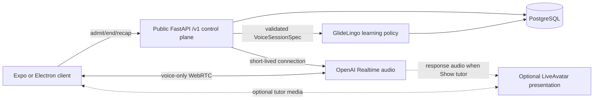

# GlideLingo Voice + Avatar Platform

**Status:** Supporting technical contract; implementation not yet complete
**Canonical product contract:** [`PRODUCT.md`](../../PRODUCT.md)
**First release language:** Modern Greek (`en` learner language -> `el-GR` target language)

This document explains how to implement the V1 voice and optional avatar requirements in
`PRODUCT.md`. If the two documents conflict, `PRODUCT.md` wins and this document must be corrected.

## 1. Decision summary

GlideLingo has three separate audio concerns:

| Product experience | V1 pipeline |
|---|---|
| Authored lesson examples | Authored text -> Google Text-to-Speech -> stored/cached audio |
| Live guided conversation and Just Talk | Learner microphone <-> OpenAI Realtime audio |
| Pronunciation assessment | Learner recording -> separately validated audio evaluator |

The locked V1 decisions are:

1. Keep Google-generated lesson audio for deterministic authored content.
2. Always support a direct OpenAI Realtime voice-only conversation path.
3. Offer LiveAvatar as the optional, user-selectable **Show tutor** presentation over the same
   `VoiceSessionSpec`.
4. Continue voice-only when Show tutor is off, unavailable, disabled by policy, too costly, or fails.
5. Keep GlideLingo authoritative for curriculum, scenario goals, scoring, progress, evidence, XP,
   entitlements, unlocks, and release policy.
6. Never infer pronunciation quality from a transcript alone.
7. Keep provider-specific transport and presentation choices behind application-owned contracts.

LiveAvatar is not the tutor brain and is not a prerequisite for V1 conversation. It is an optional
presentation adapter that may render the selected tutor from the same scenario, voice, and policy
specification used by voice-only sessions.

## 2. Current `main` reality

As audited at `786a1141410e01c3b2e6484d455fe4d340039820`, the repository contains:

| Existing capability | Current value | Realtime gap |
|---|---|---|
| Expo SDK 57 and React Native 0.86 | Shared iOS, Android, and web client | No realtime microphone/session feature |
| Electron around Expo web | Secure desktop shell | No approved microphone/WebRTC integration |
| `expo-audio` playback | Authored lesson audio output | No live two-way voice session |
| Google `el-GR` assets | Deterministic Greek examples | Not a live conversation engine |
| Public FastAPI under `backend/` | `/v1` auth, billing, and lesson-tutor boundaries | No voice-session admission/end/recap API |
| Clerk and RevenueCat foundations | Verified identity and server-owned entitlement code | RevenueCat activation remains gated and disabled |
| Private `services/lesson-tutor` | Dormant, bounded text-only OpenAI runtime | No Realtime audio session |
| PostgreSQL foundation | Durable API state | No voice-session, usage, recap, or cleanup records |
| Deterministic learning state | Application-owned evidence semantics | No live conversation evidence pipeline |

Do not describe the architecture below as implemented. Do not enable existing tutor or billing flags
as part of voice development until their independent activation gates pass.

## 3. Ownership boundary

| Owner | Responsibility |
|---|---|
| GlideLingo client | Permission, controls, captions, presentation preference, accessible status, and rendering |
| Public FastAPI API | Authentication, entitlement, admission, limits, `VoiceSessionSpec`, session lifecycle, persistence, and final outcomes |
| GlideLingo learning policy | Curriculum, scenario transitions, scoring, evidence, XP, unlocks, and recap rules |
| OpenAI Realtime | Live audio understanding, turn handling, response generation, spoken output, and bounded tool calls |
| LiveAvatar | Optional room/avatar rendering and lip synchronization when Show tutor is enabled |
| Audio evaluator | Optional acoustic/pronunciation feedback after language-specific validation |

OpenAI and LiveAvatar may emit observations. Neither provider may own or directly mutate curriculum,
scoring, XP, evidence, entitlement, mastery, completion, or unlock state.

## 4. One application contract: `VoiceSessionSpec`

Every live conversation starts from one immutable, server-validated `VoiceSessionSpec`. Both
voice-only and Show tutor use it.

```ts
type VoiceSessionSpec = {
  courseId: string;
  courseVersion: string;
  scenarioId: string;
  scenarioVersion: string;
  conversationMode: 'guided' | 'just-talk';
  sourceLocale: string;
  targetLocale: string;
  personaId: string;
  voiceId: string;
  learnerLevel: string;
  capabilityIds: string[];
  correctionPolicyVersion: string;
  evidencePolicyVersion: string;
  maximumDurationSeconds: number;
  presentation: {
    showTutor: boolean;
    avatarId?: string;
  };
};
```

The request may contain identifiers and the learner's Show tutor preference. FastAPI resolves all
authoritative versions, level/evidence context, entitlements, limits, and allowlisted provider
configuration. The client must not claim a level, completion, entitlement, allowance, XP award, or
provider identity.

The pre-session presentation choice must not change the scenario, prompt policy, voice, evidence
rules, or application session ID. If Show tutor becomes unavailable, the session continues or
resumes at a safe turn boundary as voice-only without replaying an applied event.

## 5. End-to-end architecture



The diagram expresses ownership, not a mandatory network topology. The direct OpenAI Realtime path
must work without LiveAvatar. When Show tutor is enabled, the selected LiveAvatar integration may
provision its own room or use a custom participant, but it must preserve the same application
contract and clean voice-only fallback.

### 5.1 Static lesson path

```text
authored lesson text
  -> existing Google TTS generation
  -> stored/cached asset
  -> expo-audio playback
```

This path must continue working without OpenAI, LiveAvatar, WebRTC, or a Pro entitlement.

### 5.2 Required direct voice-only path

```text
learner chooses a scenario
  -> POST /v1/voice-sessions with showTutor=false
  -> FastAPI authenticates and resolves VoiceSessionSpec
  -> FastAPI mediates OpenAI Realtime setup using server-held credentials
  -> client and OpenAI exchange live audio over the supported realtime transport
  -> FastAPI/sideband application control validates tool proposals and lifecycle
  -> deterministic GlideLingo code finalizes recap, evidence, XP, and unlocks
```

The client receives only short-lived, minimally scoped connection material. A long-lived OpenAI key
must never enter a client bundle, log, room metadata, or analytics payload.

### 5.3 Optional Show tutor path

With `presentation.showTutor=true`, GlideLingo may use LiveAvatar LITE to render the selected tutor.
The user selects Show tutor before starting, and policy or plan configuration may make it
unavailable. The conversation remains an OpenAI Realtime voice session governed by the same
`VoiceSessionSpec`.

The first implementation spike may evaluate LiveAvatar's managed OpenAI Realtime connector. It is
acceptable only if it preserves:

- the direct voice-only baseline;
- bounded context and the same persona/voice/scenario behavior;
- observable, cancellable tool calls;
- reliable interruption and session cleanup;
- application-owned lifecycle and cost records;
- voice-only continuation at a safe turn boundary;
- zero provider authority over learning or entitlement state.

### 5.4 Custom-agent fallback for Show tutor

If the managed connector cannot satisfy the contract, a private `services/voice-agent` participant
may join the LiveAvatar room and own the OpenAI Realtime connection, tool registration, response
audio, cancellation, and telemetry. LiveAvatar continues to render only.

Do not create `services/voice-agent` until the spike proves it necessary. This implementation choice
must not alter product routes, `VoiceSessionSpec`, session states, recap, evidence, XP, or voice-only
availability.

## 6. State and event model

Session lifecycle, turn state, presentation state, and events are separate concepts. Do not flatten
them into one ambiguous status enum.

### 6.1 Session lifecycle

| Lifecycle state | Meaning |
|---|---|
| `creating` | FastAPI is validating admission and creating the application session |
| `connecting` | The selected realtime transport is being established |
| `active` | The application session is live; inspect turn state for conversational activity |
| `reconnecting` | Transport recovery is running under a visible deadline |
| `ending` | No new learner turn is accepted; providers and durable outcomes are closing |
| `ended` | Terminal success/cancel/timeout state with an end reason |
| `failed` | Terminal typed failure with a safe retry or exit action |

Only valid transitions may be persisted. `ended` and `failed` are terminal. Reconnect, end, provider
stop, transcript processing, and final writes must be idempotent.

### 6.2 Turn state

Turn state is meaningful only while lifecycle is `active`:

```text
ready -> listening -> thinking -> speaking -> ready
                      |             |
                      +-> interrupted <-+
```

`needs-clarification`, `goal-observed`, `off-topic`, and `needs-repeat` are typed outcomes/events,
not session lifecycle states.

### 6.3 Presentation state

```text
voice-only
avatar-connecting
avatar-active
avatar-failed
```

Presentation failure does not force the session lifecycle to `failed` when OpenAI audio remains
healthy.

### 6.4 Event envelope

Every provider event must be normalized before product code consumes it:

```ts
type VoiceSessionEvent = {
  eventId: string;
  sessionId: string;
  turnId?: string;
  sequence: number;
  occurredAt: string;
  type:
    | 'transcript.partial'
    | 'transcript.final'
    | 'response.started'
    | 'response.completed'
    | 'audio.started'
    | 'audio.stopped'
    | 'response.interrupted'
    | 'avatar.available'
    | 'avatar.unavailable'
    | 'scenario.observation-proposed'
    | 'session.warning'
    | 'session.failed';
  payload: unknown;
};
```

Provider event IDs are evidence, not application idempotency keys. GlideLingo assigns stable event
IDs and validates sequence, scope, schema, and replay before any durable effect.

## 7. Public API boundary

Use the repository's existing `/v1` convention:

```text
POST /v1/voice-sessions
POST /v1/voice-sessions/{session_id}/end
GET  /v1/voice-sessions/{session_id}/recap
POST /v1/pronunciation-attempts
```

The create request identifies the course/scenario, language pair, conversation mode, client
capabilities, consented caption/transcript preference, and Show tutor preference. The response
contains only the application session ID, resolved non-secret display configuration, lifecycle,
expiry/maximum duration, and a tagged connection payload for the selected transport.

Automatic avatar fallback changes only presentation and connection material. It cannot change
learning policy or mint a second application session, and it must not consume additional avatar
minutes after provider stop is confirmed.

The server record stores:

- pseudonymous learner reference;
- the resolved `VoiceSessionSpec` and version;
- lifecycle, end reason, and normalized event cursor;
- OpenAI session/call reference and optional LiveAvatar session reference;
- start/end timestamps and attributed provider usage;
- consent/retention policy version;
- admission and finalization idempotency keys;
- bounded recap, evidence, and XP references.

Never place Clerk tokens, email, RevenueCat payloads, or unrelated learner history in provider
context or room metadata.

## 8. Client implementation boundary

The product feature belongs under `src/features/speak/` when implementation is authorized:

- `api/` — `/v1` requests and schemas;
- `components/` — controls, captions, presentation, fallback portrait, and recap;
- `hooks/` — application lifecycle, turn state, devices, and cleanup;
- `model/` — `VoiceSessionSpec`, state, events, and reducer;
- `screens/` — Speak home, preview, live session, and recap;
- `providers/` — direct OpenAI transport and optional avatar-presentation adapters.

Expo Router files should remain thin. Native and web/Electron provider files may differ at the
realtime SDK boundary; product state and contracts remain shared.

Implementation must verify physical iPhone and Android development builds plus Electron. It must
cover microphone denial, audio route changes, Bluetooth/headsets, interruption, backgrounding,
sleep/wake, device changes, network loss, and app termination. Do not claim Expo Go support without
evidence.

## 9. Required controls and learner feedback

Every live session requires:

- Start conversation;
- mute/unmute microphone;
- interrupt/stop coach response;
- repeat, slower, and hint actions;
- captions on/off;
- End session;
- retry/reconnect with a visible deadline;
- a pre-session **Show tutor** control when the avatar presentation is available;
- a persistent voice-only path when Show tutor is off or fails.

The UI presents lifecycle and turn state separately. The optional avatar must never obscure the
goal, state, controls, captions, or failure recovery.

## 10. Scenario context and learning authority

Every guided scenario defines stable IDs and versions, prerequisite capabilities, goal, authored
opening, language policy, allowed vocabulary/grammar, persona, voice, hint ladder, correction policy,
duration, observation rubric, completion rule, evidence mapping, and safe exits.

Allowlisted tools should be narrow:

```text
get_session_context()
request_hint(level)
request_repeat(speed)
record_support_used(kind)
propose_goal_observation(goal_id, evidence_ref)
propose_correction(code, evidence_ref)
request_scenario_end(reason)
```

Read tools return bounded context. Write-like tools create proposals only. Deterministic backend code
validates that the scenario and evidence exist, the event belongs to this learner/session/turn, the
transition is allowed, support is represented, confidence is sufficient, and the event has not
already been applied.

OpenAI and LiveAvatar never write progress, mastery, evidence, XP, entitlement, or unlock state.

## 11. Failure and fallback contract

| Failure | Required behavior |
|---|---|
| Show tutor unavailable before start | Start the same spec voice-only and explain that the tutor view is unavailable |
| Avatar video fails while OpenAI audio is healthy | Stop avatar billing, set presentation `avatar-failed`, continue voice-only |
| Managed connector cannot preserve the turn | Resume direct voice-only at the last durable turn boundary; do not replay effects |
| OpenAI Realtime fails | End provider activity, preserve durable turns, offer safe retry/exit, grant no false completion |
| Brief transport disconnect | Enter lifecycle `reconnecting` and recover within a visible deadline |
| Transport cannot recover | End server-side and preserve recap for durable turns |
| Transcript unavailable | Do not fabricate transcript-dependent feedback |
| Microphone denied | Explain permission and keep non-speaking course use available |
| Allowance expires | Finish the current safe boundary, stop providers, keep valid recap |
| Client disappears | Server cleanup stops orphaned provider sessions |
| Provider event repeats | Stable event IDs prevent duplicate effects or usage accounting |

Authored lesson playback must not depend on any live provider. Avatar health must not determine voice
session success.

## 12. Pronunciation boundary

A correct transcript means the system likely understood the intended words. It does not prove sound
production, stress, rhythm, or accent quality.

- Realtime conversation may assess communicative meaning under a validated scenario rubric.
- Transcript-only feedback may address vocabulary or grammar.
- Pronunciation or phoneme/accent claims require a separate audio method validated for the exact
  language and task.
- Low confidence asks for a repeat instead of issuing a negative grade.
- Target playback and learner recording comparison remain available when scoring is unavailable.

Greek pronunciation claims remain blocked until agreement with qualified Greek raters meets an
approved release threshold.

## 13. Security and privacy invariants

- Provider credentials remain server-side; clients receive only short-lived scoped material.
- Admission derives identity and entitlement from verified server context.
- One active application session per learner is the default.
- Every session has maximum duration, idle timeout, turn/spend limits, and cleanup deadline.
- Raw production audio retention defaults off.
- Transcript retention requires a clear user setting and deletion path.
- Opt-in evaluation audio is isolated, encrypted, access-controlled, purpose-bound, and deletable.
- Provider storage and sensitive trace logging are minimized or disabled where supported.
- Do not log bearer tokens, connection secrets, provider keys, secret IDs, or raw Clerk identity.
- Provider/agent callbacks authenticate and validate exact application-session scope.
- The backend treats every provider payload as untrusted.

Provider data handling must be verified against the current provider terms and the product's approved
privacy posture before enablement; a local implementation does not satisfy that gate.

## 14. Observability and release gates

Measure end of learner turn to first audible coach audio, plus API admission, direct connection,
optional avatar connection/first frame, turn detection, first model audio, interruption, reconnect,
provider stop confirmation, recap completion, and attributed cost.

Segment by presentation mode, platform, app version, language pair, learner level, network class,
region, model/avatar configuration version, and scenario version.

Initial gates:

- direct voice-only succeeds on physical iPhone, Android, and Electron;
- Show tutor on/off produces the same scenario and learning outcomes;
- avatar failure never blocks healthy voice;
- cancel/error/termination tests leave no orphaned provider session;
- retry/reconnect/provider replay cannot duplicate turns, evidence, or XP;
- stable authored eval cases meet the approved pedagogical threshold;
- native-speaker review passes understanding, accent, dialect, and response appropriateness;
- latency and cost support the defined allowance;
- no pronunciation score ships before audio-evaluator validation.

## 15. Cost and provider controls

- Static Google audio consumes no live-session minutes.
- Direct OpenAI usage and optional avatar usage are attributed separately per application session.
- Show tutor consumes no avatar minutes when unselected and stops consuming them when it fails and provider stop is
  confirmed.
- Plan allowance, concurrency, idle timeout, maximum duration, and rate limits are server-owned.
- Product copy never describes avatar minutes as required conversation minutes.
- Unlimited avatar conversation does not ship before observed unit economics are margin-positive.

LiveAvatar is the selected optional V1 avatar adapter. Tavus may be benchmarked as an alternative,
but replacing a presentation provider must not alter `VoiceSessionSpec`, direct voice availability,
learning authority, client state, recap, evidence, or XP.

## 16. Vertical-slice plan

### Slice 0 — contract and evaluation bench

- Freeze `VoiceSessionSpec`, lifecycle, turn, presentation, and normalized event contracts.
- Create a consented/de-identified Greek learner audio seed set.
- Benchmark OpenAI Realtime understanding, output accent/dialect, code-switching, turn timing, safety,
  interruption, and tool events.

**Gate:** reviewed schemas, stable cases, and native-speaker scorecard.

### Slice 1 — direct voice-only baseline

- Add authenticated `/v1/voice-sessions` admission/end/recap boundaries.
- Connect one Greek guided scenario directly to OpenAI Realtime.
- Add lifecycle/turn reducers, captions, controls, cleanup, entitlement, and telemetry.
- Prove existing Google lesson audio remains independent.

**Gate:** one complete voice-only conversation on physical iPhone, Android, and Electron with no
orphaned session or false learning write.

### Slice 2 — optional Show tutor

- Add the pre-session Show tutor preference to voice-session admission.
- Evaluate the LiveAvatar managed connector against the same `VoiceSessionSpec`.
- Render the tutor on native development builds and Electron/web.
- Prove opt-out, provider unavailability, and avatar-failure fallback.

**Gate:** voice-only and avatar-presented runs produce equivalent authoritative outcomes, and avatar
failure never ends healthy voice.

### Slice 3 — realtime learning-control gate

- Prove tool event/result delivery, cancellation, dynamic context, and correlation.
- Keep the managed avatar connector only if every control passes.
- Otherwise add a private custom participant without changing the product contract.
- Run deterministic completion after normalized provider observations.

**Gate:** no provider can directly create a learning, billing, or unlock effect.

### Slice 4 — recap and product integration

- Build truthful recap and supported-vs-independent evidence.
- Apply idempotent evidence and XP only after server validation.
- Connect Home, Course, Speak, Practice, and Progress.
- Add allowance and presentation availability UI.

**Gate:** the complete product acceptance scenario passes without duplicate or false claims.

### Slice 5 — per-language release and scale

- Version model, voice, persona, avatar, language, and policy configuration.
- Load/concurrency test direct and optional avatar modes.
- Add provider fallback only for measured needs.
- Add pronunciation only after independent evaluator validation.

**Gate:** quality, reliability, learning value, and margin improve together for each released
language.

## 17. Definition of success

A credible V1 lets a learner:

1. play deterministic authored lesson audio;
2. enter a course-connected scenario;
3. complete it through direct OpenAI Realtime voice on every supported client;
4. optionally select Show tutor without changing the learning contract;
5. continue voice-only when avatar presentation is unselected, unavailable, or fails;
6. interrupt, ask for help, reconnect, or end safely;
7. receive a truthful recap;
8. earn evidence/XP only from deterministic GlideLingo rules;
9. delete retained conversation data;
10. see consistent outcomes across supported mobile and desktop targets.

The moat is authored curriculum, learner-aware conversation, measured language quality,
deterministic evidence, useful review, and polished presentation. The avatar alone is not the moat.

## 18. Official sources

### OpenAI Realtime

- [Realtime API reference](https://platform.openai.com/docs/api-reference/realtime)
- [Realtime models](https://developers.openai.com/api/docs/models)
- [Create a WebRTC call](https://developers.openai.com/api/reference/typescript/resources/realtime/subresources/calls/methods/create)
- [Realtime client events](https://platform.openai.com/docs/api-reference/realtime-client-events)
- [Realtime server events](https://platform.openai.com/docs/api-reference/realtime-server-events)
- [OpenAI data controls](https://developers.openai.com/api/docs/guides/your-data)

### LiveAvatar

- [Avatar Only (LITE) overview](https://docs.liveavatar.com/docs/lite-mode/overview)
- [Integration paths](https://docs.liveavatar.com/docs/lite-mode/integration-paths)
- [OpenAI Realtime connector](https://docs.liveavatar.com/docs/lite-mode/connectors/openai-realtime)
- [LITE lifecycle](https://docs.liveavatar.com/docs/lite-mode/lifecycle)
- [LITE events](https://docs.liveavatar.com/docs/lite-mode/events)
- [Custom LiveKit agent](https://docs.liveavatar.com/docs/guides/livekit/custom-livekit-agent)
- [Create session token](https://docs.liveavatar.com/api-reference/sessions/create-session-token)
- [Start session](https://docs.liveavatar.com/api-reference/sessions/start-session)
- [Stop session](https://docs.liveavatar.com/api-reference/sessions/stop-session)

### Existing GlideLingo contracts

- [Canonical product requirements](../../PRODUCT.md)
- [Infrastructure direction](../infra/README.md)
- [Learning-system reference](../learning/README.md)
