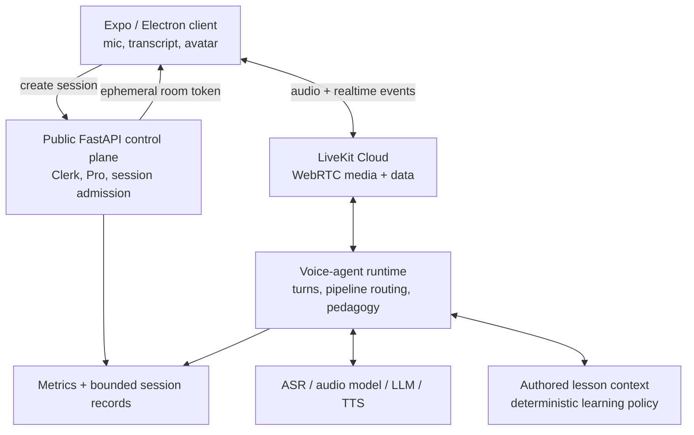

# GlideLingo Voice + Avatar Platform

Status: proposed architecture and execution plan  
First language: Modern Greek (`en` learner language -> `el-GR` target language)  
Scope: voice tutor, speaking drills, roleplay, pronunciation feedback, and a synchronized tutor avatar

## The decision

GlideLingo should build a **hybrid voice platform**, not one universal voice bot:

- Use a **cascade pipeline** (`ASR -> learning policy/LLM -> TTS`) when meaning, lesson control, corrections, and cost matter most.
- Use **audio-aware or speech-to-speech evaluation** when pronunciation, tone, rhythm, or accent matters. A transcript cannot prove how a learner pronounced a word.
- Start learner exercises with **manual turn completion** (push-to-talk / tap Done). Language learners pause while searching for words, and treating a short pause as the end of a turn damages both transcription and the experience.
- Treat the **avatar as an output renderer**, not the intelligence. The learning system must remain correct with the avatar disabled.
- Earn global deployment and provider failover through measured traffic. Do not copy Speak's Kubernetes footprint before GlideLingo has the load that requires it.

Speak's engineering article is real architectural signal for the voice system: WebRTC through LiveKit, feature-specific voice-agent servers, a hybrid cascade/speech-to-speech strategy, per-language provider evaluation, learner-aware turn detection, and end-to-end observability. It does **not** disclose Speak's avatar implementation, model prompts, provider scorecards, training data, or exact latency/accuracy numbers. We should copy the principles, then produce our own evidence for Greek.

## Current GlideLingo reality

| Existing capability | What it gives us | Gap for live voice |
| --- | --- | --- |
| Expo SDK 57 + React Native 0.86 | Shared Android/iOS product | LiveKit requires native development builds; it does not run in Expo Go |
| Expo web inside Electron | Shared desktop product | Electron needs the web LiveKit boundary and secure microphone permissions |
| `expo-audio` pronunciation playback | Verified client audio output | No recording, realtime transport, streaming playback, or turn control yet |
| Generated Greek audio using Google `el-GR-Chirp3-HD-Aoede` | Strong authored-course pronunciation baseline | Batch/static MP3 generation is not a realtime agent voice |
| Public FastAPI API + Clerk + RevenueCat server authorization | Correct control-plane boundary | No ephemeral voice-session/token endpoint yet |
| IAM-private `services/lesson-tutor` runtime | Authored context, bounded history, privacy-safe OpenAI use | Text-only one-turn request/response; no streamed audio or realtime session state |
| Deterministic lesson spine | AI cannot silently change progress or mastery | Voice decisions still need typed, deterministic outcomes |
| Cloud Run development platform in `us-west1` | A safe starting deployment | No long-lived media worker, multi-region routing, object storage, or voice failover |
| Text tutor eval cases | A behavioral regression seed | No recorded-audio corpus, ASR, turn-taking, TTS, pronunciation, or avatar evals |

The existing tutor boundary should be reused conceptually: authored lesson context is authoritative, identity remains pseudonymous, model storage stays disabled, and AI never owns official scoring or progress. The realtime service is a new data-plane workload; it should not turn the public FastAPI API into a long-lived media server.

## Product modes require different pipelines

| Mode | Primary question | Recommended pipeline | Turn completion |
| --- | --- | --- | --- |
| Repeat a word/phrase | "How did the learner say it?" | Recorded audio -> pronunciation/audio assessor -> deterministic feedback template; ASR is supporting evidence | Manual |
| Structured tutor lesson | "Did they answer, and what correction teaches the objective?" | ASR -> authored objective evaluator -> tutor response -> streaming TTS | Manual first |
| Immersive roleplay | "Did they communicate the intended meaning naturally?" | Streaming ASR -> roleplay policy/LLM -> streaming TTS | Semantic/learner-tuned automatic |
| Accent/rhythm coaching | "What acoustic property should change?" | Speech-to-speech or validated audio model, plus bounded coaching output | Manual first |
| Clarifying question | "What does the learner want explained?" | ASR -> existing page-aware tutor policy -> streaming TTS | Manual or automatic |

This prevents a common false claim: **a correct transcript is not a pronunciation score**. ASR systems often normalize imperfect speech into the intended word. GlideLingo must never show phoneme-level or accent accuracy until an audio-based method has been validated for the exact target language and exercise.

## Target architecture



### Control plane: existing public FastAPI

FastAPI should own short, authenticated actions:

- Verify the Clerk session and server-side Pro entitlement.
- Enforce session, duration, concurrency, and spend limits.
- Create a pseudonymous voice-session record.
- Mint a short-lived LiveKit participant token with the minimum room permissions.
- Select an allowed experience configuration: language pair, lesson/mission, mode, and provider profile.
- End or revoke a session and accept a bounded completion summary.

Proposed first contracts:

```text
POST /v1/voice-sessions
POST /v1/voice-sessions/{session_id}/end
POST /v1/pronunciation-attempts       # bounded recorded drill, before live coaching
```

The client never receives LiveKit, ASR, TTS, avatar, or model provider secrets. A room token is short-lived and room-scoped; it is not a general API credential.

### Realtime data plane: `services/voice-agent`

Create this service only when the first working voice slice is implemented. It should own:

- Joining the LiveKit room as the agent participant.
- Capturing learner audio and publishing agent audio/events.
- Manual and automatic turn state machines.
- Choosing the pipeline for the current activity.
- Calling typed provider adapters for ASR, audio assessment, LLM, and TTS.
- Loading only allowlisted, authored lesson/mission context.
- Emitting typed learning observations; never directly mutating mastery or progress.
- Recording per-stage timings, provider results, fallbacks, and costs.

The public API remains the authorization boundary. The voice agent receives a pseudonymous actor reference and bounded activity context, not a Clerk token, email, profile, or RevenueCat state.

### Learning policy remains above the model

Every voice turn should resolve to a typed outcome before the lesson advances:

```ts
type VoiceTurnOutcome =
  | { kind: 'understood'; objectiveIds: string[]; evidence: EvidenceRef[] }
  | { kind: 'needs-correction'; correctionCode: string; evidence: EvidenceRef[] }
  | { kind: 'needs-repeat'; reason: 'low-confidence' | 'noise' | 'incomplete' }
  | { kind: 'clarifying-question'; topic: string }
  | { kind: 'off-topic' };
```

The model may propose an outcome and teaching response, but deterministic code validates:

- the activity and objectives exist in the published course version;
- evidence is from the current turn;
- confidence is sufficient for the claim;
- the requested transition is allowed;
- no unsupported pronunciation or mastery claim is made.

Low confidence should produce "I didn't catch that—try once more," not a confident correction.

## Avatar architecture

The avatar should subscribe to the same agent-audio stream and session events as the rest of the UI. It should not make lesson decisions or call the model.

### Recommended path

1. **V1: GlideLingo-owned stylized tutor avatar.** Animate idle/listening/thinking/speaking states. Drive mouth openness from realtime audio energy so it works on iOS, Android, web, and Electron with one visual language.
2. **V1.5: viseme-driven mouth shapes.** If the chosen Greek TTS emits timestamped viseme IDs, map them to a small cross-platform mouth-shape set. Azure documents Greek `el-GR` TTS and viseme-ID support, though Greek does not receive the full blend-shape support listed for some languages.
3. **Later: photorealistic video-avatar provider behind an adapter.** Benchmark LiveAvatar LITE, D-ID, and Tavus for mobile compatibility, Greek lip sync, time-to-first-video, interruptions, cost per minute, privacy, and failure recovery. Do not let a vendor own the conversation policy or lesson state.

The preferred product default is the owned stylized avatar. It is cheaper, brandable, consistent with GlideLingo's calm experience, and can fall back gracefully on weak networks. A photorealistic stream should be an enhancement, not a dependency for learning.

### Avatar event contract

```ts
type AvatarState = 'idle' | 'listening' | 'thinking' | 'speaking' | 'reconnecting';

type AvatarEvent =
  | { type: 'state'; state: AvatarState; atMs: number }
  | { type: 'viseme'; id: number; atMs: number; durationMs: number }
  | { type: 'emotion'; value: 'neutral' | 'encouraging' | 'corrective'; atMs: number };
```

Keep emotion choices bounded and pedagogical. The avatar should not over-celebrate weak evidence or shame errors.

## Provider strategy for Modern Greek

Speak's strongest lesson is not "pick its provider." It is **evaluate providers by language pair and task**. GlideLingo should maintain versioned provider profiles rather than hard-code one vendor everywhere.

| Capability | First candidates | What must be measured |
| --- | --- | --- |
| Greek ASR | Google Chirp 3, Azure Speech, OpenAI realtime/transcription | Learner WER/CER, target-word recall, code-switching, noise, partial/final latency |
| Greek realtime TTS | Existing Google Chirp 3 HD voice, Azure Greek neural voices, ElevenLabs multilingual/flash | Native-speaker MOS, Greek stress/pronunciation, English<->Greek code-switching, first audio, stream stability |
| Pronunciation assessment | Audio-capable model spike plus an application-owned grader; provider APIs only if `el-GR` is explicitly supported | Agreement with Greek instructors, false correction rate, error localization, calibration by level |
| Turn detection | Manual commit for drills; conservative VAD/endpointing for Greek roleplay | Premature cutoff, excessive wait, self-correction handling, noise behavior |
| Avatar | Owned audio-reactive/viseme renderer first; vendor spike later | Audio/video sync, reconnect behavior, CPU/battery, mobile/web parity, cost |

Important current constraint: Microsoft's published pronunciation-assessment locale list contains 33 locales and does **not** list Greek. Azure supports Greek STT/TTS and Greek viseme IDs, but that must not be misrepresented as a validated Greek pronunciation score. LiveKit's current audio turn detector also does not list Greek among its calibrated languages. For Greek hands-free mode, begin with conservative VAD/STT endpointing and build a Greek learner pause corpus before claiming semantic turn detection.

Provider interfaces should be narrow and based on current product needs:

```py
class SpeechRecognizer(Protocol): ...
class PronunciationAssessor(Protocol): ...
class StreamingSpeechSynthesizer(Protocol): ...
class RealtimeConversationModel(Protocol): ...
```

Multi-provider routing is justified only after the eval harness proves that one provider cannot meet all Greek tasks or after reliability requires a fallback.

## How GlideLingo reaches Speak-level quality

There is no single "accuracy" number. Quality is a scorecard across the complete learner experience.

### 1. Build a Greek learner audio corpus

Start with at least 300 consented, de-identified utterances covering:

- native target pronunciations;
- A1/A2 learner attempts with instructor-labeled errors;
- expected phrases and open-ended roleplay;
- English/Greek code-switching;
- long pauses, restarts, fillers, and self-corrections;
- phone, laptop, headset, and inexpensive microphones;
- quiet, café noise, room echo, and competing speech.

Raw evaluation audio must have explicit consent, a documented retention period, access controls, and a deletion path. Normal production sessions should not retain raw audio by default.

### 2. Separate five eval suites

| Suite | Core measurements |
| --- | --- |
| ASR | WER/CER, target-word recall, semantic-intent accuracy, code-switch accuracy, time to final transcript |
| Turn taking | premature-cutoff rate, false interruption rate, end-of-turn delay, manual-abandon rate |
| Teaching policy | correct objective decision, valid correction, no answer leakage, no unsupported scoring, recovery to lesson |
| TTS | native-speaker naturalness, stress/dialect correctness, code-switch quality, time to first audio, realtime factor |
| Pronunciation | agreement with at least two qualified Greek raters, false-positive correction rate, calibration by learner level |

Avatar quality is measured separately: first visible movement, audio/video offset, dropped frames, reconnect time, and whether avatar failures ever block audio learning.

### 3. Proposed release gates

These are internal targets, not claims about Speak's unpublished numbers. Baseline them on real devices, then tighten them:

- No official pronunciation score until human agreement meets the reviewed threshold and severe false corrections are acceptably rare.
- At least 95% correct pedagogical decisions on stable authored cases before enabling a new tutor profile.
- Premature cutoff below 2% for the target Greek learner test set before defaulting an activity to hands-free mode.
- Turn-end to first audible agent response: target P50 under 1.5 seconds and P95 under 2.5 seconds for cascade roleplay.
- Provider/session technical failure below 1% in the release cohort.
- Avatar audio/video offset target under 100 ms; audio continues if video quality degrades.

Every result must be segmented by platform, app version, language pair, learner level, provider/model version, region, and network class. P50 alone is insufficient; inspect P95/P99 and provider timeout tails.

### 4. Instrument the latency budget

Measure one user-facing clock from learner turn completion to first audible agent audio, plus:

```text
turn-end
  -> ASR final transcript
  -> learning decision
  -> LLM first token
  -> TTS first byte
  -> client first audio
  -> avatar first synchronized frame
```

Record provider/model version, region, fallback, timeout, and estimated cost for every stage. Sample content only with consent; timings and error codes should not require raw audio or transcript logging.

## Vertical-slice execution plan

### Slice 0 — provider and eval bench

**Outcome:** we can compare Greek speech providers before product architecture hardens around one.

- Create a versioned Greek audio seed set and human labels.
- Benchmark at least two ASR and two TTS options.
- Add cost and latency reporting.
- Decide the first `el-GR` provider profile from evidence.

**Gate:** one written scorecard with raw metric exports and native-speaker review.

### Slice 1 — bounded push-to-talk tutor, no avatar dependency

**Outcome:** during one authored lesson step, a learner records a bounded utterance, sees the transcript, and hears a context-aware spoken response.

- Add platform recording boundaries using Expo SDK 57 APIs.
- Use manual commit and a strict duration/byte limit.
- Add one authenticated `pronunciation-attempts` or voice-turn endpoint.
- Reuse authored lesson context and existing tutor safety rules.
- Stream or progressively play the TTS reply.
- Emit a typed `VoiceTurnOutcome`; do not mutate mastery.

**Gate:** works on one physical iPhone, one physical Android device, and Electron; low-confidence audio asks for a repeat; text tutor behavior does not regress.

### Slice 2 — owned tutor avatar

**Outcome:** the same voice tutor visibly listens, thinks, and speaks through a GlideLingo avatar.

- Add shared avatar states.
- Drive speaking from agent-audio energy first.
- Add a viseme spike if the winning TTS supplies usable Greek timing.
- Preserve audio-only fallback and reduced-motion behavior.

**Gate:** synchronized on all targets, avatar disconnect never loses the lesson turn, and CPU/battery impact is measured.

### Slice 3 — LiveKit roleplay

**Outcome:** a learner completes one Greek mission through a low-latency conversation.

- Add LiveKit Expo native dependencies and development builds; document that Expo Go is no longer sufficient for this feature.
- Use the LiveKit web client for browser/Electron behind platform files.
- Add the authenticated voice-session control-plane contracts.
- Add `services/voice-agent` for one roleplay mission.
- Start cascade-first with conservative turn settings and a manual fallback.
- Add interruption/cancel semantics and reconnect UX.

**Gate:** objective completion is deterministic, P50/P95 latency meets the cohort target, and a provider timeout fails into a recoverable UI state.

### Slice 4 — validated pronunciation coaching

**Outcome:** GlideLingo gives one specific, evidence-backed Greek pronunciation correction.

- Compare an audio-capable model and any explicitly Greek-capable pronunciation provider.
- Require instructor-labeled agreement and confidence calibration.
- Return the smallest useful feedback: one contrast and one retry.
- Persist the provider/model/eval version with the evidence record.

**Gate:** reviewed human-agreement threshold passes; unsupported details are suppressed; low confidence never becomes a negative grade.

### Slice 5 — hybrid speech-to-speech and operational scaling

**Outcome:** audio-rich coaching or lower-latency modes are enabled only where they outperform cascade.

- Run cascade and speech-to-speech A/B evals per activity.
- Add provider fallback only for measured reliability needs.
- Add a second region when learner geography shows a real latency problem.
- Consider dedicated autoscaling infrastructure only after concurrency/load evidence.

**Gate:** quality, latency, retention, and cost improvements are demonstrated together; no global rollout from a demo-quality result.

## Security, privacy, and cost invariants

- Provider credentials remain server-side in version-pinned secret storage.
- Voice-session tokens are short-lived, audience/room scoped, and minimally privileged.
- Raw Clerk identity never enters provider prompts, traces, room metadata, or avatar vendors.
- Raw production audio is not retained by default. Opt-in eval capture is isolated and deletable.
- Model/provider storage and sensitive logging are disabled where supported.
- Each session has maximum duration, turn count, concurrent-session, and spend limits.
- Agent and provider calls have deadlines; fallback behavior is explicit.
- No avatar provider may receive more transcript/audio/context than its rendering job requires.
- The avatar cannot authorize, score, update progress, or decide mastery.

## Definition of success

GlideLingo has reached a credible Speak-like V1 when a Greek learner can:

1. enter a real authored mission;
2. speak naturally, including pauses and self-correction;
3. see what the system understood;
4. receive a fast, relevant spoken response;
5. get a correction only when evidence supports it;
6. continue through a synchronized tutor avatar;
7. complete an objective whose progress decision is deterministic and auditable.

The moat is not the avatar alone. It is the combined system: authored curriculum, learner-aware audio handling, evidence-backed evaluation, low-latency conversation, and a polished character layer.

## References

- [Speak: Building Speak's Voice Agent Platform](https://www.speak.com/blog/building-speaks-voice-agent-platform)
- [LiveKit: Expo quickstart](https://docs.livekit.io/home/quickstarts/expo)
- [LiveKit: turn detection](https://docs.livekit.io/agents/logic/turns/turn-detector/)
- [OpenAI: Realtime API](https://platform.openai.com/docs/api-reference/realtime)
- [Google Cloud: Speech-to-Text supported languages](https://cloud.google.com/speech-to-text/v2/docs/speech-to-text-supported-languages)
- [Google Cloud: supported TTS voices](https://cloud.google.com/text-to-speech/docs/list-voices-and-types)
- [Microsoft Azure Speech: language, pronunciation-assessment, and viseme support](https://learn.microsoft.com/azure/ai-services/speech-service/language-support)
- [LiveAvatar: FULL vs. LITE architecture](https://docs.liveavatar.com/)
- [D-ID: realtime agent architecture](https://docs.d-id.com/docs/realtime-overview)
- [Tavus: Conversational Video Interface](https://docs.tavus.io/sections/conversational-video-interface/overview-cvi)
